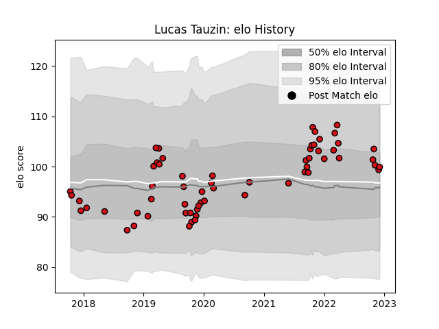

---  
layout: page  
title: Lucas Tauzin  
date: 2022-12-18 16:39:53.176178  
categories: player  
---
# Lucas Tauzin

## Positions: W, C

## Current elo: 105.0

## Current Percentile: 69.0

# Elo History

# Match History

| Team             |   Appearances |   Win Rate |
|:-----------------|--------------:|-----------:|
| Stade Toulousain |            63 |   0.634921 |

| Opponent             |   Matches |   Win Rate |
|:---------------------|----------:|-----------:|
| Lyon                 |         7 |   0.428571 |
| Montpellier Herault  |         7 |   0.714286 |
| Clermont Auvergne    |         6 |   0.5      |
| Racing 92            |         5 |   0.6      |
| Stade Francais Paris |         4 |   0.375    |
| Bordeaux Begles      |         4 |   0.5      |
| Castres Olympique    |         4 |   0.75     |
| La Rochelle          |         4 |   0.75     |
| Toulon               |         3 |   0.666667 |
| Sale Sharks          |         3 |   0.833333 |
| Bayonne              |         3 |   0.333333 |
| Pau                  |         2 |   1        |
| Brive                |         2 |   0.5      |
| Perpignan            |         2 |   1        |
| Agen                 |         1 |   1        |
| Munster              |         1 |   1        |
| Gloucester Rugby     |         1 |   1        |
| Connacht             |         1 |   1        |
| Cardiff Blues        |         1 |   0        |
| Biarritz Olympique   |         1 |   1        |
| Grenoble             |         1 |   1        |