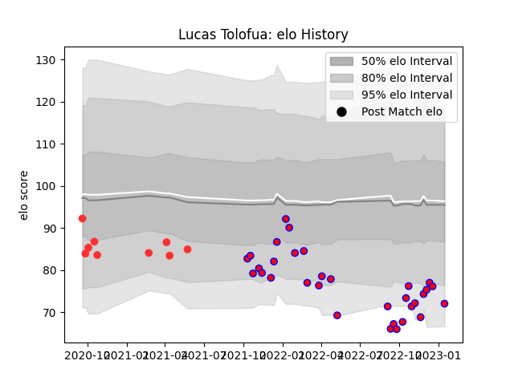

---  
layout: page  
title: Lucas Tolofua  
date: 2022-11-16 11:23:17.925276  
categories: player  
---
# Lucas Tolofua

## Positions: L, N8

## Current elo: 83.0

## Current Percentile: 12.0

# Elo History

# Match History

| Team    |   Appearances |   Win Rate |
|:--------|--------------:|-----------:|
| Blagnac |            17 |   0.470588 |
| Tarbes  |             3 |   0.166667 |

| Opponent                   |   Matches |   Win Rate |
|:---------------------------|----------:|-----------:|
| Chambery                   |         2 |       0.5  |
| Cognac Saint Jean d'Angély |         2 |       0.75 |
| Dax                        |         2 |       0    |
| Dijon                      |         2 |       0.5  |
| Tarbes                     |         2 |       1    |
| Valence Romans Drome Rugby |         2 |       0    |
| Albi                       |         1 |       1    |
| Bourgoin-Jallieu           |         1 |       0    |
| Carqueiranne-Hyères        |         1 |       1    |
| Narbonne                   |         1 |       0    |
| Rennes                     |         1 |       1    |
| Soyaux-Angouleme           |         1 |       0    |
| Suresnes                   |         1 |       0    |
| US Bressane                |         1 |       0    |