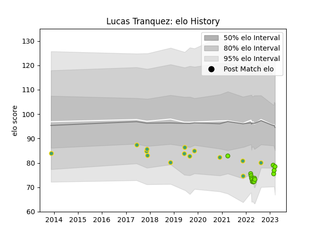

---  
layout: page  
title: Lucas Tranquez  
date: 2023-03-04 11:40:00.230380  
categories: player  
---
# Lucas Tranquez

## Positions: W, FB

## Country: Brazil

## Current elo: 76.0

## Current Percentile: 11.0

# Elo History

# Match History

| Team   |   Appearances |   Win Rate |
|:-------|--------------:|-----------:|
| Brazil |            14 |   0.214286 |
| Cobras |            12 |   0.166667 |

| Opponent          |   Matches |   Win Rate |
|:------------------|----------:|-----------:|
| Portugal          |         4 |   0.5      |
| Cafeteros Pro     |         3 |   0.333333 |
| Olimpia Lions     |         2 |   0.5      |
| Penarol Rugby     |         2 |   0        |
| Spain             |         2 |   0        |
| Jaguares XV       |         2 |   0        |
| Uruguay           |         1 |   0        |
| Selknam           |         1 |   0        |
| Romania           |         1 |   0        |
| Belgium           |         1 |   1        |
| Pampas XV         |         1 |   0        |
| New Zealand Maori |         1 |   0        |
| Kenya             |         1 |   0        |
| Germany           |         1 |   0        |
| Dogos XV          |         1 |   0        |
| Chile             |         1 |   0        |
| Zimbabwe          |         1 |   0        |