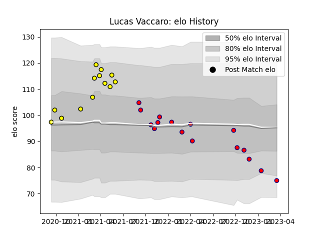

---  
layout: page  
title: Lucas Vaccaro  
date: 2023-03-21 18:50:35.626666  
categories: player  
---
# Lucas Vaccaro

Last updated: 2023-03-21
## Positions: C

## Current elo: 75.0

## Current Percentile: 11.0

# Elo History

# Match History

| Team     |   Appearances |   Win Rate |
|:---------|--------------:|-----------:|
| Aurillac |            16 |   0.125    |
| Albi     |            13 |   0.576923 |

| Opponent           |   Matches |   Win Rate |
|:-------------------|----------:|-----------:|
| Agen               |         2 |        0   |
| Colomiers          |         2 |        0   |
| Suresnes           |         2 |        0.5 |
| Rouen              |         2 |        0.5 |
| Nevers             |         2 |        0.5 |
| Mont-de-Marsan     |         2 |        0   |
| Aubenas            |         2 |        1   |
| US Bressane        |         2 |        0   |
| Bayonne            |         2 |        0   |
| Chambery           |         1 |        1   |
| Dijon              |         1 |        1   |
| Bourgoin-Jallieu   |         1 |        1   |
| Blagnac            |         1 |        0   |
| Narbonne           |         1 |        1   |
| Biarritz Olympique |         1 |        0   |
| Nice               |         1 |        0.5 |
| Oyonnax            |         1 |        0   |
| Beziers            |         1 |        0   |
| Tarbes             |         1 |        0   |
| Grenoble           |         1 |        0   |