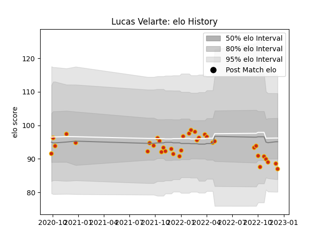

---  
layout: page  
title: Lucas Velarte  
date: 2022-12-18 16:26:10.047869  
categories: player  
---
# Lucas Velarte

## Positions: H, N8

## Current elo: 89.0

## Current Percentile: 15.0

# Elo History

# Match History

| Team      |   Appearances |   Win Rate |
|:----------|--------------:|-----------:|
| Perpignan |            37 |   0.405405 |

| Opponent             |   Matches |   Win Rate |
|:---------------------|----------:|-----------:|
| Toulon               |         3 |   0.666667 |
| Stade Toulousain     |         3 |   0.333333 |
| Stade Francais Paris |         3 |   0        |
| Racing 92            |         3 |   0.333333 |
| La Rochelle          |         3 |   0.333333 |
| Montpellier Herault  |         2 |   0        |
| Brive                |         2 |   0.5      |
| Castres Olympique    |         2 |   0.5      |
| Clermont Auvergne    |         2 |   0.5      |
| Biarritz Olympique   |         2 |   1        |
| Lyon                 |         2 |   0.5      |
| Bayonne              |         1 |   0        |
| Pau                  |         1 |   0        |
| Grenoble             |         1 |   1        |
| Mont-de-Marsan       |         1 |   1        |
| Glasgow Warriors     |         1 |   0        |
| Colomiers            |         1 |   0        |
| Carcassonne          |         1 |   1        |
| Bristol Rugby        |         1 |   0        |
| Bordeaux Begles      |         1 |   0        |
| Vannes               |         1 |   1        |