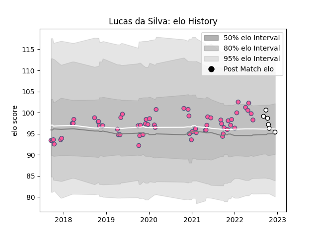

---  
layout: page  
title: Lucas da Silva  
date: 2022-12-14 11:19:51.218544  
categories: player  
---
# Lucas da Silva

## Positions: H

## Current elo: 95.0

## Current Percentile: 54.0

# Elo History

# Match History

| Team                 |   Appearances |   Win Rate |
|:---------------------|--------------:|-----------:|
| Stade Francais Paris |            62 |   0.387097 |
| Brive                |             6 |   0        |

| Opponent             |   Matches |   Win Rate |
|:---------------------|----------:|-----------:|
| Pau                  |         9 |   0.555556 |
| Racing 92            |         8 |   0.25     |
| Toulon               |         6 |   0.5      |
| Montpellier Herault  |         6 |   0.5      |
| Stade Toulousain     |         5 |   0.2      |
| Brive                |         5 |   0.4      |
| La Rochelle          |         4 |   0.5      |
| Castres Olympique    |         4 |   0.5      |
| Lyon                 |         3 |   0        |
| Clermont Auvergne    |         3 |   0        |
| Agen                 |         2 |   0.5      |
| Bristol Rugby        |         2 |   0        |
| Krasny Yar           |         2 |   0.5      |
| Bayonne              |         1 |   0        |
| Grenoble             |         1 |   0        |
| London Irish         |         1 |   1        |
| Cardiff Blues        |         1 |   0        |
| Bordeaux Begles      |         1 |   0        |
| Perpignan            |         1 |   1        |
| Biarritz Olympique   |         1 |   0        |
| Stade Francais Paris |         1 |   0        |
| Benetton Treviso     |         1 |   0        |