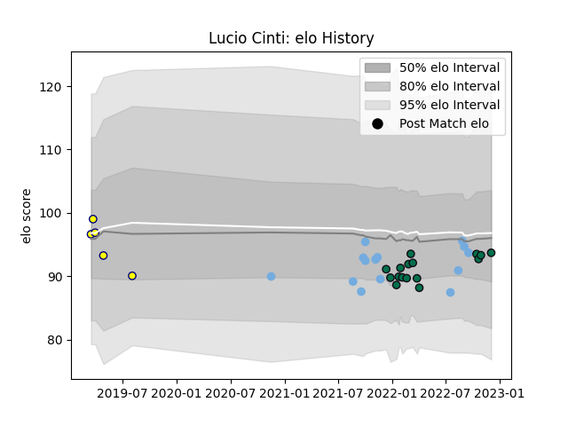

---  
layout: page  
title: Lucio Cinti  
date: 2023-03-16 19:51:39.140638  
categories: player  
---
# Lucio Cinti

## Positions: W, C

## Country: Argentina

## Current elo: 107.0

## Current Percentile: 25.0

# Elo History

# Match History

| Team         |   Appearances |   Win Rate |
|:-------------|--------------:|-----------:|
| London Irish |            28 |   0.464286 |
| Argentina    |            14 |   0.357143 |
| La Plata     |             5 |   0.4      |

| Opponent            |   Matches |   Win Rate |
|:--------------------|----------:|-----------:|
| Australia           |         4 |   0.25     |
| New Zealand         |         4 |   0.5      |
| Saracens            |         3 |   0.666667 |
| Sale Sharks         |         3 |   0.5      |
| Gloucester Rugby    |         3 |   0        |
| Harlequins          |         3 |   0.333333 |
| Leicester Tigers    |         2 |   0        |
| Stormers            |         2 |   0        |
| South Africa        |         2 |   0        |
| Newman              |         2 |   0        |
| Newcastle Falcons   |         2 |   1        |
| Montpellier Herault |         2 |   0.25     |
| Italy               |         1 |   1        |
| Bath Rugby          |         1 |   1        |
| Ireland             |         1 |   0        |
| France              |         1 |   0        |
| Exeter Chiefs       |         1 |   1        |
| Northampton Saints  |         1 |   0        |
| Pau                 |         1 |   1        |
| Edinburgh           |         1 |   1        |
| San Luis            |         1 |   1        |
| CUBA                |         1 |   0        |
| Scotland            |         1 |   1        |
| CASI                |         1 |   1        |
| Bristol Rugby       |         1 |   1        |
| Wasps               |         1 |   0        |
| Worcester Warriors  |         1 |   1        |