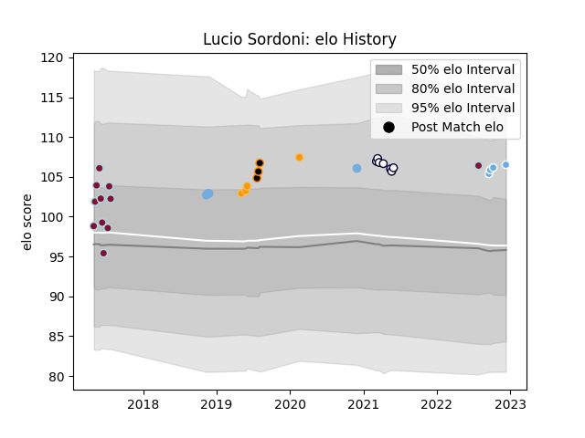

---  
layout: page  
title: Lucio Sordoni  
date: 2022-12-18 16:14:26.570327  
categories: player  
---
# Lucio Sordoni

## Positions: P

## Country: Argentina

## Current elo: 107.0

## Current Percentile: 82.0

# Elo History

# Match History

| Team                 |   Appearances |   Win Rate |
|:---------------------|--------------:|-----------:|
| Atlético del Rosario |            11 |   0.409091 |
| Melbourne Rebels     |             7 |   0.285714 |
| Argentina            |             4 |   0        |
| Glasgow Warriors     |             4 |   0.75     |
| Jaguares             |             4 |   1        |
| Jaguares XV          |             3 |   1        |

| Opponent                 |   Matches |   Win Rate |
|:-------------------------|----------:|-----------:|
| Western Force            |         2 |        0.5 |
| Queensland Reds          |         2 |        1   |
| New South Wales Waratahs |         2 |        1   |
| Bath Rugby               |         1 |        1   |
| Stormers                 |         1 |        1   |
| Scotland                 |         1 |        0   |
| San Luis                 |         1 |        1   |
| SWD Eagles               |         1 |        1   |
| SIC                      |         1 |        0.5 |
| Regatas Bella Vista      |         1 |        0   |
| Newman                   |         1 |        0   |
| New Zealand              |         1 |        0   |
| Los Tilos                |         1 |        1   |
| La Plata                 |         1 |        1   |
| Ireland                  |         1 |        0   |
| Alumni                   |         1 |        0   |
| Hindu                    |         1 |        0   |
| Highlanders              |         1 |        0   |
| France                   |         1 |        0   |
| Eastern Province Kings   |         1 |        1   |
| Cardiff Blues            |         1 |        1   |
| CUBA                     |         1 |        0   |
| CASI                     |         1 |        1   |
| Bulls                    |         1 |        1   |
| Brumbies                 |         1 |        0   |
| Border Bulldogs          |         1 |        1   |
| Blues                    |         1 |        0   |
| Benetton Treviso         |         1 |        0   |
| Belgrano                 |         1 |        0   |
| Hurricanes               |         1 |        0   |