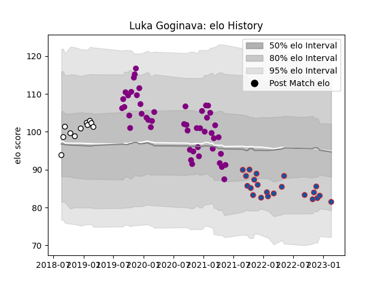

---  
layout: page  
title: Luka Goginava  
date: 2023-03-17 17:19:58.462663  
categories: player  
---
# Luka Goginava

## Positions: P

## Current elo: 80.0

## Current Percentile: 11.0

# Elo History

# Match History

| Team             |   Appearances |   Win Rate |
|:-----------------|--------------:|-----------:|
| Soyaux-Angouleme |            48 |   0.40625  |
| Grenoble         |            25 |   0.48     |
| Brive            |            11 |   0.409091 |

| Opponent                   |   Matches |   Win Rate |
|:---------------------------|----------:|-----------:|
| Beziers                    |         7 |   0.571429 |
| Carcassonne                |         7 |   0.357143 |
| Colomiers                  |         6 |   0.5      |
| Aurillac                   |         5 |   0.6      |
| Biarritz Olympique         |         5 |   0.3      |
| Mont-de-Marsan             |         5 |   0.4      |
| Montauban                  |         5 |   0.3      |
| Rouen                      |         5 |   0.6      |
| Nevers                     |         5 |   0.6      |
| Oyonnax                    |         5 |   0        |
| Provence Rugby             |         4 |   0.5      |
| Grenoble                   |         4 |   0.25     |
| US Bressane                |         3 |   0.333333 |
| Vannes                     |         3 |   0.333333 |
| Perpignan                  |         3 |   0        |
| Bayonne                    |         3 |   0.333333 |
| Roval Drome XV             |         2 |   0.5      |
| Soyaux-Angouleme           |         2 |   1        |
| Massy                      |         2 |   0.5      |
| Valence Romans Drome Rugby |         2 |   0.75     |
| Narbonne                   |         1 |   1        |