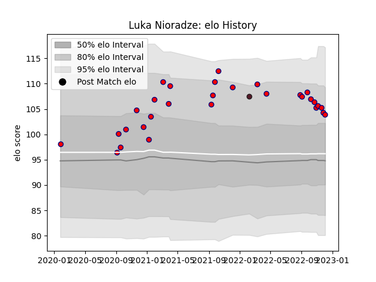

---  
layout: page  
title: Luka Nioradze  
date: 2023-01-13 11:32:41.382301  
categories: player  
---
# Luka Nioradze

## Positions: H

## Country: Georgia

## Current elo: 115.0

## Current Percentile: 88.0

# Elo History

# Match History

| Team     |   Appearances |   Win Rate |
|:---------|--------------:|-----------:|
| Aurillac |            53 |   0.481132 |
| Georgia  |             1 |   0.5      |

| Opponent                   |   Matches |   Win Rate |
|:---------------------------|----------:|-----------:|
| Mont-de-Marsan             |         5 |        0.2 |
| Rouen                      |         5 |        0.8 |
| Provence Rugby             |         5 |        0.6 |
| Colomiers                  |         5 |        0.6 |
| Nevers                     |         4 |        0.5 |
| Oyonnax                    |         4 |        0.5 |
| Vannes                     |         4 |        0.5 |
| Grenoble                   |         4 |        0.5 |
| Carcassonne                |         3 |        0   |
| Biarritz Olympique         |         2 |        0   |
| Beziers                    |         2 |        1   |
| Valence Romans Drome Rugby |         2 |        0.5 |
| Agen                       |         2 |        0   |
| Montauban                  |         1 |        0   |
| Narbonne                   |         1 |        1   |
| Bayonne                    |         1 |        0   |
| Perpignan                  |         1 |        0.5 |
| Portugal                   |         1 |        0.5 |
| Soyaux-Angouleme           |         1 |        1   |
| US Bressane                |         1 |        1   |