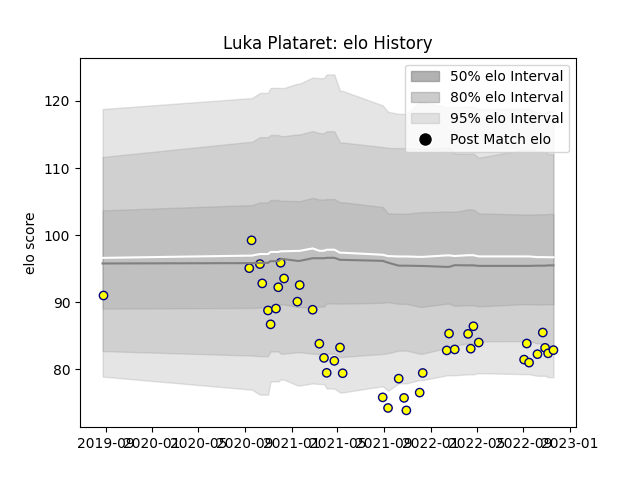

---  
layout: page  
title: Luka Plataret  
date: 2023-02-02 18:43:28.758138  
categories: player  
---
# Luka Plataret

## Positions: FL

## Current elo: 89.0

## Current Percentile: 21.0

# Elo History

# Match History

| Team   |   Appearances |   Win Rate |
|:-------|--------------:|-----------:|
| Nevers |            59 |   0.550847 |

| Opponent                   |   Matches |   Win Rate |
|:---------------------------|----------:|-----------:|
| Vannes                     |         5 |   0.5      |
| Beziers                    |         5 |   0.8      |
| Soyaux-Angouleme           |         5 |   0.8      |
| Oyonnax                    |         4 |   0.25     |
| Biarritz Olympique         |         4 |   0.625    |
| Colomiers                  |         4 |   0.25     |
| Grenoble                   |         4 |   0.125    |
| Rouen                      |         4 |   1        |
| Provence Rugby             |         4 |   0.75     |
| Agen                       |         3 |   0.666667 |
| Carcassonne                |         3 |   0.666667 |
| Aurillac                   |         2 |   0        |
| Perpignan                  |         2 |   0        |
| Mont-de-Marsan             |         2 |   0        |
| US Bressane                |         2 |   1        |
| Valence Romans Drome Rugby |         2 |   0.5      |
| Montauban                  |         2 |   0.5      |
| Narbonne                   |         1 |   1        |
| Massy                      |         1 |   1        |