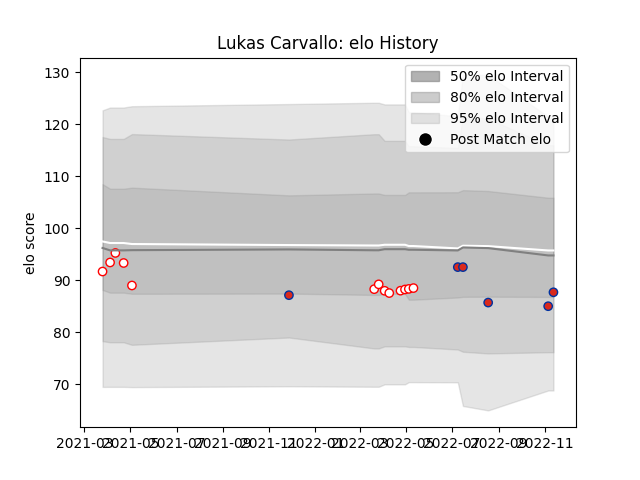

---  
layout: page  
title: Lukas Carvallo  
date: 2023-03-04 11:35:06.943848  
categories: player  
---
# Lukas Carvallo

## Positions: SH, W

## Country: Chile

## Current elo: 88.0

## Current Percentile: 21.0

# Elo History

# Match History

| Team    |   Appearances |   Win Rate |
|:--------|--------------:|-----------:|
| Selknam |            13 |   0.692308 |
| Chile   |             6 |   0.5      |

| Opponent                 |   Matches |   Win Rate |
|:-------------------------|----------:|-----------:|
| Cobras                   |         4 |       0.75 |
| Jaguares XV              |         4 |       0.5  |
| Cafeteros Pro            |         3 |       1    |
| United States of America |         2 |       0.5  |
| Brazil                   |         1 |       1    |
| Olimpia Lions            |         1 |       1    |
| Penarol Rugby            |         1 |       0    |
| Romania                  |         1 |       0    |
| Russia                   |         1 |       1    |
| Tonga                    |         1 |       0    |