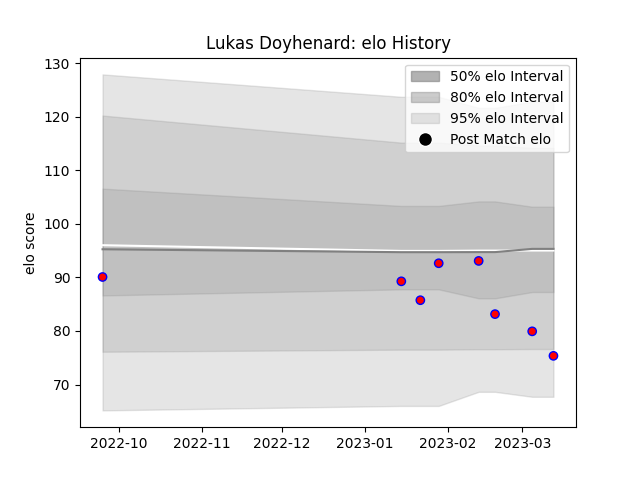

---  
layout: page  
title: Lukas Doyhenard  
date: 2023-03-17 17:33:13.529472  
categories: player  
---
# Lukas Doyhenard

## Positions: W, C

## Current elo: 77.0

## Current Percentile: 16.0

# Elo History

# Match History

| Team    |   Appearances |   Win Rate |
|:--------|--------------:|-----------:|
| Blagnac |             9 |   0.722222 |

| Opponent                   |   Matches |   Win Rate |
|:---------------------------|----------:|-----------:|
| US Bressane                |         2 |        0.5 |
| Albi                       |         1 |        0   |
| Chambery                   |         1 |        1   |
| Cognac Saint Jean d'Angély |         1 |        1   |
| Dax                        |         1 |        1   |
| Rennes                     |         1 |        1   |
| Tarbes                     |         1 |        0.5 |
| Valence Romans Drome Rugby |         1 |        1   |