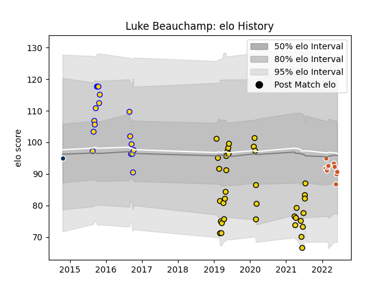

---  
layout: page  
title: Luke Beauchamp  
date: 2023-03-09 10:08:38.946081  
categories: player  
---
# Luke Beauchamp

## Positions: FL

## Current elo: 91.0

## Current Percentile: 33.0

# Elo History

# Match History

| Team               |   Appearances |   Win Rate |
|:-------------------|--------------:|-----------:|
| Houston SaberCats  |            36 |   0.222222 |
| Brisbane City      |            17 |   0.705882 |
| Austin Gilgronis   |            10 |   0.8      |
| Queensland Country |             1 |   0        |

| Opponent               |   Matches |   Win Rate |
|:-----------------------|----------:|-----------:|
| Utah Warriors          |         5 |   0.6      |
| Seattle Seawolves      |         5 |   0.4      |
| San Diego Legion       |         5 |   0.4      |
| Rugby New York         |         4 |   0        |
| R.U. New York          |         4 |   0        |
| L. A. Giltinis         |         4 |   0.25     |
| Toronto Arrows         |         3 |   0        |
| Canberra Vikings       |         3 |   0.666667 |
| Melbourne Rising       |         3 |   0.333333 |
| North Harbour Rays     |         2 |   0.5      |
| Sydney Stars           |         2 |   1        |
| Queensland Country     |         2 |   1        |
| Perth Spirit           |         2 |   0.5      |
| Old Glory DC           |         2 |   0.5      |
| Austin Elite Rugby     |         2 |   1        |
| Austin Gilgronis       |         2 |   0        |
| NSW Country Eagles     |         2 |   0.5      |
| NOLA Gold              |         2 |   0.5      |
| Greater Sydney Rams    |         2 |   1        |
| Glendale Raptors       |         2 |   0.5      |
| Houston SaberCats      |         1 |   1        |
| Rugby ATL              |         1 |   0        |
| Dallas Jackals         |         1 |   1        |
| Colorado Raptors       |         1 |   1        |
| Austin Herd            |         1 |   0        |
| New England Free Jacks |         1 |   0        |