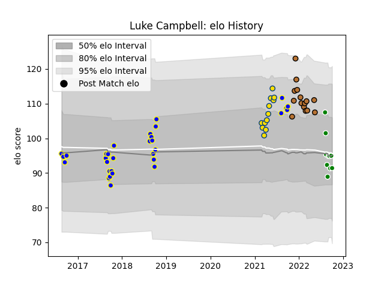

---  
layout: page  
title: Luke Campbell  
date: 2023-03-16 20:15:18.267665  
categories: player  
---
# Luke Campbell

## Positions: SH

## Current elo: 91.0

## Current Percentile: 50.0

# Elo History

# Match History

| Team          |   Appearances |   Win Rate |
|:--------------|--------------:|-----------:|
| Bay of Plenty |            31 |   0.403226 |
| Narbonne      |            15 |   0.166667 |
| Hurricanes    |            12 |   0.416667 |
| Manawatu      |            10 |   0        |

| Opponent                 |   Matches |   Win Rate |
|:-------------------------|----------:|-----------:|
| Otago                    |         5 |   0.4      |
| Taranaki                 |         5 |   0.2      |
| Hawke's Bay              |         4 |   0.25     |
| Wellington               |         4 |   0.25     |
| Waikato                  |         3 |   0.333333 |
| Northland                |         3 |   0.333333 |
| North Harbour            |         3 |   0        |
| Southland                |         3 |   1        |
| Counties Manukau         |         3 |   0.5      |
| Auckland                 |         2 |   0        |
| Manawatu                 |         2 |   0.5      |
| Highlanders              |         2 |   1        |
| Crusaders                |         2 |   0        |
| Tasman                   |         2 |   0        |
| Chiefs                   |         2 |   0        |
| Carcassonne              |         2 |   0        |
| Canterbury               |         2 |   0        |
| Vannes                   |         2 |   0.25     |
| Blues                    |         2 |   0        |
| Queensland Reds          |         1 |   1        |
| US Bressane              |         1 |   1        |
| Rouen                    |         1 |   1        |
| Agen                     |         1 |   0        |
| Montauban                |         1 |   0        |
| Oyonnax                  |         1 |   0        |
| New South Wales Waratahs |         1 |   1        |
| Nevers                   |         1 |   0        |
| Mont-de-Marsan           |         1 |   0        |
| Grenoble                 |         1 |   0        |
| Colomiers                |         1 |   0        |
| Brumbies                 |         1 |   0        |
| Beziers                  |         1 |   0        |
| Bayonne                  |         1 |   0        |
| Western Force            |         1 |   1        |