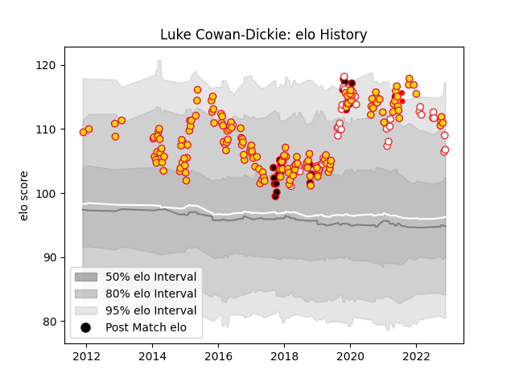

---  
layout: page  
title: Luke Cowan-Dickie  
date: 2022-11-15 23:35:53.891702  
categories: player  
---
# Luke Cowan-Dickie

## Positions: H

## Country: England

## Current elo: 111.0

## Current Percentile: 87.0

# Elo History

# Match History

| Team                    |   Appearances |   Win Rate |
|:------------------------|--------------:|-----------:|
| Exeter Chiefs           |           155 |   0.7      |
| England                 |            38 |   0.644737 |
| Cornish Pirates         |            21 |   0.571429 |
| British and Irish Lions |             3 |   0.333333 |

| Opponent                 |   Matches |   Win Rate |
|:-------------------------|----------:|-----------:|
| Saracens                 |        17 |   0.441176 |
| Wasps                    |        16 |   0.65625  |
| Bath Rugby               |        13 |   0.692308 |
| Sale Sharks              |        13 |   0.692308 |
| Northampton Saints       |        12 |   0.75     |
| Gloucester Rugby         |         9 |   0.611111 |
| Bristol Rugby            |         9 |   0.666667 |
| Harlequins               |         9 |   0.777778 |
| London Irish             |         8 |   0.75     |
| Leicester Tigers         |         8 |   0.875    |
| Worcester Warriors       |         7 |   0.857143 |
| Wales                    |         7 |   0.571429 |
| South Africa             |         7 |   0.285714 |
| Newcastle Falcons        |         6 |   1        |
| Australia                |         5 |   0.8      |
| France                   |         5 |   0.6      |
| Glasgow Warriors         |         4 |   0.375    |
| Ireland                  |         4 |   0.75     |
| Italy                    |         4 |   1        |
| Hartpury College         |         3 |   1        |
| Jersey                   |         3 |   0.333333 |
| La Rochelle              |         3 |   1        |
| Nottingham               |         3 |   0.666667 |
| Ospreys                  |         3 |   0.666667 |
| Scotland                 |         3 |   0.166667 |
| London Welsh             |         2 |   1        |
| Munster                  |         2 |   0.25     |
| Argentina                |         2 |   0.5      |
| Clermont Auvergne        |         2 |   0        |
| Ealing Trailfinders      |         2 |   0.5      |
| Castres Olympique        |         2 |   0.5      |
| London Scottish          |         2 |   0        |
| Doncaster                |         2 |   1        |
| Yorkshire Carnegie       |         2 |   0.5      |
| Leinster                 |         2 |   0        |
| Japan                    |         1 |   1        |
| Stade Toulousain         |         1 |   1        |
| Bayonne                  |         1 |   1        |
| Bordeaux Begles          |         1 |   1        |
| Cardiff Blues            |         1 |   1        |
| United States of America |         1 |   1        |
| Ulster                   |         1 |   1        |
| Tonga                    |         1 |   1        |
| New Zealand              |         1 |   1        |
| Racing 92                |         1 |   1        |
| Cavalieri Prato          |         1 |   1        |
| Scarlets                 |         1 |   1        |
| Connacht                 |         1 |   1        |
| Rotherham Titans         |         1 |   1        |
| Richmond                 |         1 |   1        |
| Montpellier Herault      |         1 |   1        |