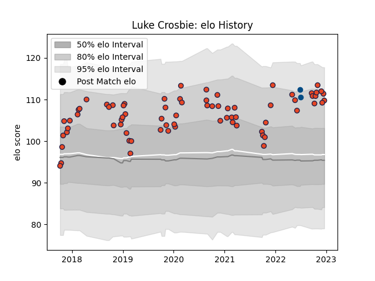

---  
layout: page  
title: Luke Crosbie  
date: 2022-12-09 13:07:42.084928  
categories: player  
---
# Luke Crosbie

## Positions: FL

## Country: Scotland

## Current elo: 109.0

## Current Percentile: 89.0

# Elo History

# Match History

| Team      |   Appearances |   Win Rate |
|:----------|--------------:|-----------:|
| Edinburgh |            70 |   0.628571 |
| Scotland  |             2 |   0.5      |

| Opponent            |   Matches |   Win Rate |
|:--------------------|----------:|-----------:|
| Glasgow Warriors    |         7 |   0.714286 |
| Zebre               |         6 |   0.833333 |
| Cardiff Blues       |         6 |   0.666667 |
| Dragons             |         6 |   0.833333 |
| Benetton Treviso    |         6 |   0.333333 |
| Scarlets            |         5 |   0.8      |
| Ulster              |         4 |   0.25     |
| Southern Kings      |         4 |   0.75     |
| Leinster            |         3 |   0.333333 |
| Bulls               |         2 |   0.5      |
| Bordeaux Begles     |         2 |   0.25     |
| Toulon              |         2 |   1        |
| Connacht            |         2 |   1        |
| Ospreys             |         2 |   0.5      |
| Krasny Yar          |         2 |   1        |
| Stormers            |         2 |   0.25     |
| Munster             |         2 |   0        |
| Saracens            |         1 |   1        |
| Agen                |         1 |   1        |
| Newcastle Falcons   |         1 |   1        |
| Montpellier Herault |         1 |   1        |
| London Irish        |         1 |   1        |
| Argentina           |         1 |   0        |
| Chile               |         1 |   1        |
| Cheetahs            |         1 |   0        |
| Lions               |         1 |   0        |