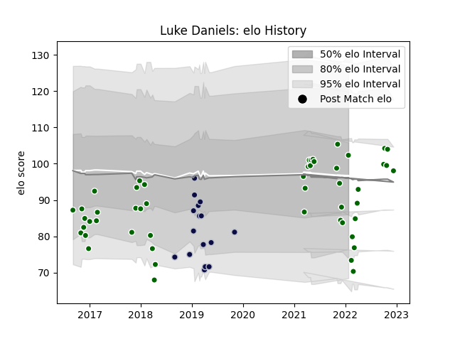

---  
layout: page  
title: Luke Daniels  
date: 2022-12-18 16:33:59.642258  
categories: player  
---
# Luke Daniels

## Positions: FB, W

## Current elo: 87.0

## Current Percentile: 21.0

# Elo History

# Match History

| Team                |   Appearances |   Win Rate |
|:--------------------|--------------:|-----------:|
| Ealing Trailfinders |            42 |   0.785714 |
| Bristol Rugby       |            14 |   0.607143 |

| Opponent           |   Matches |   Win Rate |
|:-------------------|----------:|-----------:|
| Bedford            |         6 |   0.833333 |
| London Scottish    |         5 |   0.8      |
| Richmond           |         5 |   1        |
| Doncaster          |         5 |   0.4      |
| Jersey             |         3 |   1        |
| Rotherham Titans   |         3 |   1        |
| Nottingham         |         3 |   0.666667 |
| Ampthill           |         3 |   1        |
| Hartpury College   |         2 |   1        |
| La Rochelle        |         2 |   0.5      |
| Bath Rugby         |         2 |   0.5      |
| Coventry           |         2 |   1        |
| RC Enisei          |         2 |   1        |
| Cornish Pirates    |         2 |   0.5      |
| Sale Sharks        |         2 |   0.75     |
| Harlequins         |         1 |   0        |
| Gloucester Rugby   |         1 |   1        |
| London Welsh       |         1 |   1        |
| Newcastle Falcons  |         1 |   1        |
| Northampton Saints |         1 |   1        |
| Bristol Rugby      |         1 |   0        |
| Wasps              |         1 |   0        |
| Worcester Warriors |         1 |   0        |
| Yorkshire Carnegie |         1 |   0        |