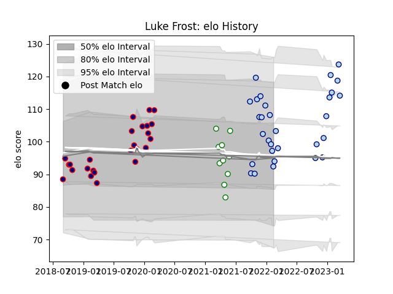

---  
layout: page  
title: Luke Frost  
date: 2023-03-21 18:08:37.875495  
categories: player  
---
# Luke Frost

Last updated: 2023-03-21
## Positions: L, FL

## Current elo: 92.0

## Current Percentile: 56.0

# Elo History

# Match History

| Team            |   Appearances |   Win Rate |
|:----------------|--------------:|-----------:|
| Bedford         |            30 |   0.533333 |
| London Scottish |            25 |   0.3      |
| Nottingham      |            10 |   0.2      |

| Opponent            |   Matches |   Win Rate |
|:--------------------|----------:|-----------:|
| Nottingham          |         7 |   0.571429 |
| Ampthill            |         6 |   0.416667 |
| Coventry            |         6 |   0.166667 |
| Doncaster           |         6 |   0.333333 |
| Hartpury College    |         6 |   0.5      |
| Richmond            |         6 |   0.333333 |
| Cornish Pirates     |         5 |   0.4      |
| Ealing Trailfinders |         5 |   0.2      |
| Jersey              |         5 |   0.6      |
| Bedford             |         3 |   0.333333 |
| Yorkshire Carnegie  |         3 |   0.666667 |
| London Irish        |         2 |   0        |
| London Scottish     |         2 |   1        |
| Caldy               |         1 |   0        |
| Newcastle Falcons   |         1 |   0        |
| Saracens            |         1 |   0        |