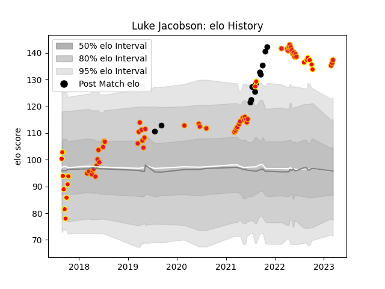

---  
layout: page  
title: Luke Jacobson  
date: 2023-03-17 17:24:28.276409  
categories: player  
---
# Luke Jacobson

## Positions: FL, N8

## Country: New Zealand

## Current elo: 137.0

## Current Percentile: 99.0

# Elo History

# Match History

| Team        |   Appearances |   Win Rate |
|:------------|--------------:|-----------:|
| Chiefs      |            53 |   0.660377 |
| Waikato     |            17 |   0.441176 |
| New Zealand |            12 |   0.916667 |

| Opponent                 |   Matches |   Win Rate |
|:-------------------------|----------:|-----------:|
| Highlanders              |         7 |   0.642857 |
| Hurricanes               |         7 |   0.5      |
| Blues                    |         6 |   0.666667 |
| Crusaders                |         6 |   0.333333 |
| Brumbies                 |         4 |   0.5      |
| New South Wales Waratahs |         4 |   1        |
| Argentina                |         3 |   1        |
| Bay of Plenty            |         3 |   0.333333 |
| Queensland Reds          |         3 |   0.666667 |
| Moana Pasifika           |         3 |   1        |
| Manawatu                 |         2 |   0.5      |
| Wellington               |         2 |   0.5      |
| Tonga                    |         2 |   1        |
| Sharks                   |         2 |   0.5      |
| North Harbour            |         2 |   0.5      |
| Melbourne Rebels         |         2 |   1        |
| Western Force            |         2 |   1        |
| Australia                |         2 |   1        |
| Bulls                    |         2 |   1        |
| Fiji                     |         2 |   1        |
| Jaguares                 |         2 |   0.5      |
| Auckland                 |         1 |   1        |
| South Africa             |         1 |   0        |
| United States of America |         1 |   1        |
| Tasman                   |         1 |   0        |
| Taranaki                 |         1 |   1        |
| Stormers                 |         1 |   1        |
| Canterbury               |         1 |   0        |
| Counties Manukau         |         1 |   1        |
| Otago                    |         1 |   0        |
| Northland                |         1 |   0        |
| Fijian Drua              |         1 |   1        |
| Hawke's Bay              |         1 |   0.5      |
| Italy                    |         1 |   1        |
| Lions                    |         1 |   0        |