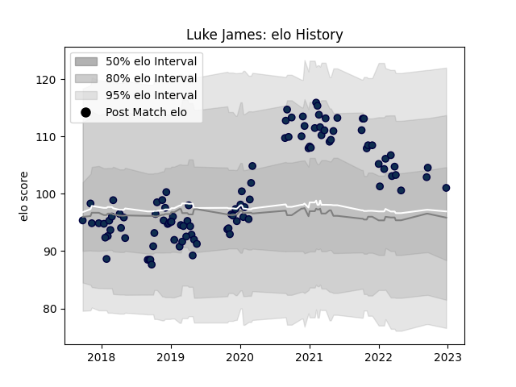

---  
layout: page  
title: Luke James  
date: 2022-12-28 12:55:31.485589  
categories: player  
---
# Luke James

## Positions: FB, C

## Current elo: 101.0

## Current Percentile: 75.0

# Elo History

# Match History

| Team        |   Appearances |   Win Rate |
|:------------|--------------:|-----------:|
| Sale Sharks |           102 |   0.583333 |

| Opponent           |   Matches |   Win Rate |
|:-------------------|----------:|-----------:|
| Exeter Chiefs      |         9 |   0.222222 |
| Leicester Tigers   |         8 |   0.75     |
| Wasps              |         8 |   0.75     |
| Saracens           |         8 |   0.25     |
| Northampton Saints |         8 |   0.75     |
| Gloucester Rugby   |         7 |   0.857143 |
| Newcastle Falcons  |         7 |   0.428571 |
| Bath Rugby         |         7 |   0.428571 |
| Bristol Rugby      |         7 |   0.642857 |
| Harlequins         |         6 |   0.666667 |
| Worcester Warriors |         6 |   0.666667 |
| London Irish       |         5 |   1        |
| La Rochelle        |         3 |   0.333333 |
| Connacht           |         3 |   0.666667 |
| Bordeaux Begles    |         2 |   0.5      |
| Glasgow Warriors   |         2 |   0        |
| Perpignan          |         2 |   1        |
| Lyon               |         1 |   1        |
| Cardiff Blues      |         1 |   0        |
| Scarlets           |         1 |   1        |
| Stade Toulousain   |         1 |   0        |