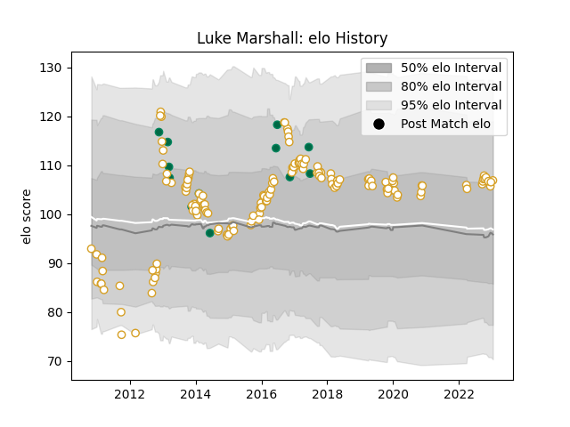

---  
layout: page  
title: Luke Marshall  
date: 2022-12-18 16:31:53.725611  
categories: player  
---
# Luke Marshall

## Positions: C

## Country: Ireland

## Current elo: 112.0

## Current Percentile: 88.0

# Elo History

# Match History

| Team    |   Appearances |   Win Rate |
|:--------|--------------:|-----------:|
| Ulster  |           150 |      0.65  |
| Ireland |            12 |      0.625 |

| Opponent                 |   Matches |   Win Rate |
|:-------------------------|----------:|-----------:|
| Scarlets                 |        14 |   0.607143 |
| Ospreys                  |        13 |   0.615385 |
| Leinster                 |        12 |   0.25     |
| Munster                  |        12 |   0.375    |
| Zebre                    |        11 |   0.909091 |
| Benetton Treviso         |        10 |   1        |
| Connacht                 |        10 |   1        |
| Glasgow Warriors         |        10 |   0.5      |
| Cardiff Blues            |         9 |   0.611111 |
| Edinburgh                |         8 |   0.75     |
| Dragons                  |         6 |   0.666667 |
| Clermont Auvergne        |         4 |   0.5      |
| Saracens                 |         3 |   0        |
| Leicester Tigers         |         3 |   1        |
| South Africa             |         2 |   0.5      |
| Scotland                 |         2 |   0.5      |
| La Rochelle              |         2 |   0        |
| Northampton Saints       |         2 |   0.5      |
| Southern Kings           |         2 |   1        |
| Stade Toulousain         |         2 |   1        |
| Aironi                   |         2 |   1        |
| Harlequins               |         2 |   1        |
| Exeter Chiefs            |         2 |   0.5      |
| Bath Rugby               |         2 |   1        |
| Japan                    |         1 |   1        |
| Canada                   |         1 |   1        |
| Wasps                    |         1 |   1        |
| United States of America |         1 |   1        |
| Stormers                 |         1 |   0        |
| Australia                |         1 |   0        |
| Bordeaux Begles          |         1 |   0        |
| Bulls                    |         1 |   0        |
| Castres Olympique        |         1 |   1        |
| Argentina                |         1 |   1        |
| Oyonnax                  |         1 |   1        |
| Cheetahs                 |         1 |   1        |
| Fiji                     |         1 |   1        |
| Montpellier Herault      |         1 |   1        |
| Lions                    |         1 |   1        |
| France                   |         1 |   0.5      |
| Italy                    |         1 |   0        |