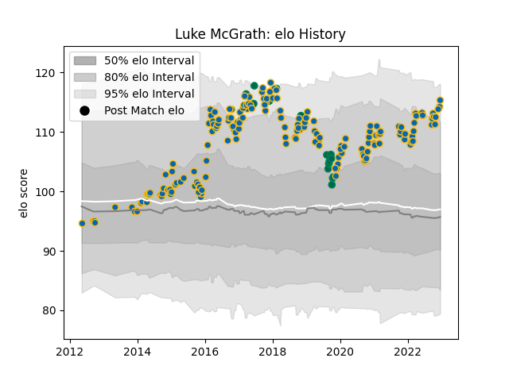

---  
layout: page  
title: Luke McGrath  
date: 2023-02-02 19:10:50.953944  
categories: player  
---
# Luke McGrath

## Positions: SH

## Country: Ireland

## Current elo: 116.0

## Current Percentile: 90.0

# Elo History

# Match History

| Team     |   Appearances |   Win Rate |
|:---------|--------------:|-----------:|
| Leinster |           176 |   0.789773 |
| Ireland  |            20 |   0.85     |

| Opponent                 |   Matches |   Win Rate |
|:-------------------------|----------:|-----------:|
| Ulster                   |        17 |   0.764706 |
| Edinburgh                |        14 |   0.785714 |
| Connacht                 |        14 |   0.642857 |
| Munster                  |        14 |   0.857143 |
| Glasgow Warriors         |        13 |   0.769231 |
| Benetton Treviso         |        13 |   0.923077 |
| Scarlets                 |        12 |   0.666667 |
| Dragons                  |        11 |   0.727273 |
| Ospreys                  |        10 |   0.75     |
| Cardiff Blues            |        10 |   0.9      |
| Zebre                    |         9 |   1        |
| Montpellier Herault      |         4 |   0.75     |
| Northampton Saints       |         4 |   1        |
| Bath Rugby               |         4 |   0.75     |
| Stade Toulousain         |         3 |   0.666667 |
| Wasps                    |         3 |   0.666667 |
| Saracens                 |         3 |   0.333333 |
| Racing 92                |         3 |   1        |
| Castres Olympique        |         3 |   0.833333 |
| United States of America |         2 |   1        |
| New Zealand              |         2 |   0.5      |
| Wales                    |         2 |   1        |
| Argentina                |         2 |   1        |
| Lyon                     |         2 |   1        |
| Italy                    |         2 |   1        |
| Bulls                    |         2 |   0.5      |
| England                  |         2 |   0.5      |
| Exeter Chiefs            |         2 |   1        |
| Japan                    |         2 |   0.5      |
| Southern Kings           |         1 |   1        |
| Canada                   |         1 |   1        |
| Cheetahs                 |         1 |   1        |
| Clermont Auvergne        |         1 |   0        |
| Scotland                 |         1 |   1        |
| Sharks                   |         1 |   1        |
| Fiji                     |         1 |   1        |
| Samoa                    |         1 |   1        |
| Russia                   |         1 |   1        |
| France                   |         1 |   1        |
| Gloucester Rugby         |         1 |   1        |
| Lions                    |         1 |   1        |