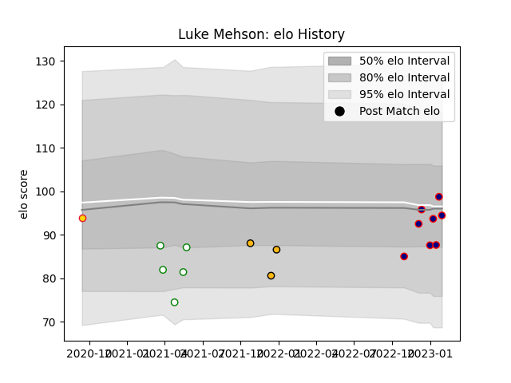

---  
layout: page  
title: Luke Mehson  
date: 2023-01-06 00:23:35.086489  
categories: player  
---
# Luke Mehson

## Positions: W

## Current elo: 101.0

## Current Percentile: 57.0

# Elo History

# Match History

| Team            |   Appearances |   Win Rate |
|:----------------|--------------:|-----------:|
| Nottingham      |             5 |   0.4      |
| London Scottish |             4 |   0.25     |
| Wasps           |             3 |   0.333333 |
| Exeter Chiefs   |             1 |   0        |

| Opponent        |   Matches |   Win Rate |
|:----------------|----------:|-----------:|
| Richmond        |         2 |        0.5 |
| Saracens        |         2 |        0   |
| Ampthill        |         1 |        0   |
| Bedford         |         1 |        1   |
| Caldy           |         1 |        1   |
| Cornish Pirates |         1 |        0   |
| Coventry        |         1 |        0   |
| Doncaster       |         1 |        0   |
| Jersey          |         1 |        0   |
| London Irish    |         1 |        1   |
| Munster         |         1 |        0   |