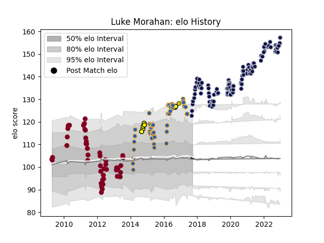

---  
layout: page  
title: Luke Morahan  
date: 2022-12-14 11:21:17.734845  
categories: player  
---
# Luke Morahan

## Positions: W, FB

## Country: Australia

## Current elo: 146.0

## Current Percentile: 99.0

# Elo History

# Match History

| Team            |   Appearances |   Win Rate |
|:----------------|--------------:|-----------:|
| Bristol Rugby   |            98 |   0.688776 |
| Queensland Reds |            49 |   0.673469 |
| Western Force   |            41 |   0.292683 |
| Perth Spirit    |             8 |   0.625    |
| Australia       |             2 |   0.5      |

| Opponent                 |   Matches |   Win Rate |
|:-------------------------|----------:|-----------:|
| Brumbies                 |        11 |   0.272727 |
| New South Wales Waratahs |        10 |   0.8      |
| Melbourne Rebels         |         9 |   0.777778 |
| Gloucester Rugby         |         9 |   0.666667 |
| Exeter Chiefs            |         8 |   0.375    |
| Northampton Saints       |         7 |   0.571429 |
| Highlanders              |         7 |   0.428571 |
| Bath Rugby               |         7 |   0.857143 |
| Stormers                 |         6 |   0.333333 |
| Queensland Reds          |         6 |   0.666667 |
| Sale Sharks              |         6 |   0.333333 |
| Cheetahs                 |         5 |   0.4      |
| Western Force            |         5 |   0.6      |
| Blues                    |         5 |   0.6      |
| London Irish             |         5 |   0.8      |
| Worcester Warriors       |         5 |   0.6      |
| Chiefs                   |         5 |   0.6      |
| Harlequins               |         5 |   0.6      |
| Newcastle Falcons        |         5 |   0.8      |
| Crusaders                |         5 |   0.2      |
| Bulls                    |         4 |   0.25     |
| Saracens                 |         4 |   0.25     |
| Sharks                   |         4 |   0        |
| Lions                    |         4 |   0.75     |
| Wasps                    |         4 |   0.25     |
| Hurricanes               |         3 |   0.333333 |
| Stade Francais Paris     |         3 |   1        |
| Leicester Tigers         |         3 |   0.666667 |
| Queensland Country       |         2 |   1        |
| Yorkshire Carnegie       |         2 |   1        |
| Nottingham               |         2 |   1        |
| Rotherham Titans         |         2 |   1        |
| Zebre                    |         2 |   0.75     |
| Ealing Trailfinders      |         2 |   1        |
| Bedford                  |         2 |   1        |
| Jersey                   |         2 |   0.5      |
| Brisbane City            |         2 |   0        |
| Brive                    |         2 |   1        |
| Cornish Pirates          |         2 |   1        |
| Melbourne Rising         |         2 |   1        |
| Doncaster                |         1 |   1        |
| Bordeaux Begles          |         1 |   1        |
| Toulon                   |         1 |   1        |
| Sydney Stars             |         1 |   1        |
| Sunwolves                |         1 |   1        |
| North Harbour Rays       |         1 |   0        |
| Dragons                  |         1 |   1        |
| Scarlets                 |         1 |   1        |
| England                  |         1 |   0        |
| France                   |         1 |   1        |
| Hartpury College         |         1 |   1        |
| Richmond                 |         1 |   1        |
| Perpignan                |         1 |   1        |
| London Scottish          |         1 |   1        |