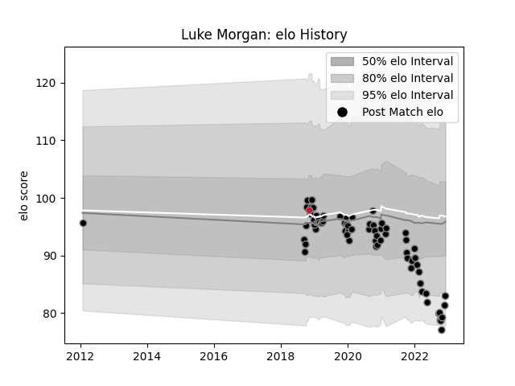

---  
layout: page  
title: Luke Morgan  
date: 2023-02-02 18:57:04.077595  
categories: player  
---
# Luke Morgan

## Positions: W

## Country: Wales

## Current elo: 108.0

## Current Percentile: 79.0

# Elo History

# Match History

| Team    |   Appearances |   Win Rate |
|:--------|--------------:|-----------:|
| Ospreys |            72 |   0.444444 |
| Wales   |             1 |   1        |

| Opponent             |   Matches |   Win Rate |
|:---------------------|----------:|-----------:|
| Dragons              |         9 |   0.611111 |
| Zebre                |         6 |   0.833333 |
| Ulster               |         6 |   0.333333 |
| Scarlets             |         6 |   0.333333 |
| Cardiff Blues        |         5 |   0.6      |
| Glasgow Warriors     |         4 |   0.5      |
| Leinster             |         4 |   0        |
| Benetton Treviso     |         4 |   1        |
| Munster              |         4 |   0        |
| Connacht             |         3 |   0        |
| Pau                  |         2 |   0.5      |
| Sharks               |         2 |   0        |
| Racing 92            |         2 |   0        |
| Edinburgh            |         2 |   1        |
| Bulls                |         2 |   0        |
| Lions                |         2 |   0        |
| Cheetahs             |         2 |   0.5      |
| Saracens             |         1 |   0        |
| Montpellier Herault  |         1 |   1        |
| Scotland             |         1 |   1        |
| Southern Kings       |         1 |   1        |
| Stade Francais Paris |         1 |   1        |
| Stormers             |         1 |   0.5      |
| Castres Olympique    |         1 |   1        |
| Worcester Warriors   |         1 |   0        |