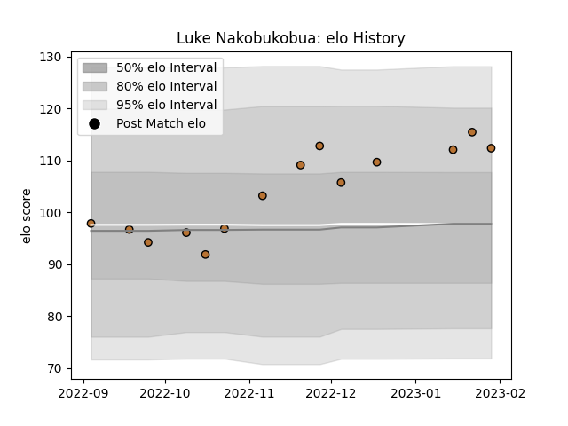

---  
layout: page  
title: Luke Nakobukobua  
date: 2023-01-15 11:45:40.558551  
categories: player  
---
# Luke Nakobukobua

## Positions: N8

## Current elo: 112.0

## Current Percentile: 79.0

# Elo History

# Match History

| Team     |   Appearances |   Win Rate |
|:---------|--------------:|-----------:|
| Narbonne |            12 |   0.708333 |

| Opponent                   |   Matches |   Win Rate |
|:---------------------------|----------:|-----------:|
| Nice                       |         2 |        1   |
| Albi                       |         1 |        0   |
| Blagnac                    |         1 |        0.5 |
| Bourgoin-Jallieu           |         1 |        1   |
| Carqueiranne-Hyères        |         1 |        1   |
| Cognac Saint Jean d'Angély |         1 |        1   |
| Rennes                     |         1 |        1   |
| Suresnes                   |         1 |        1   |
| Tarbes                     |         1 |        0   |
| US Bressane                |         1 |        1   |
| Valence Romans Drome Rugby |         1 |        0   |