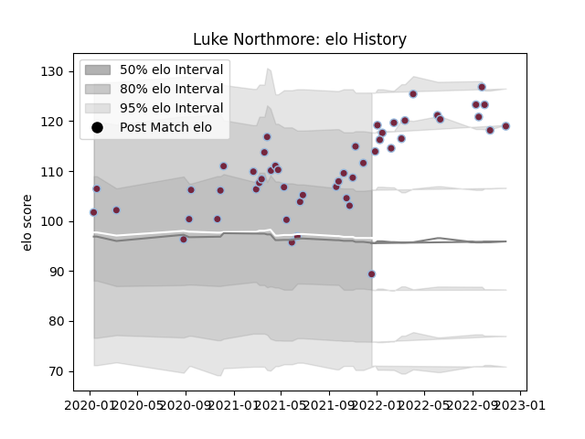

---  
layout: page  
title: Luke Northmore  
date: 2023-03-17 17:23:54.901325  
categories: player  
---
# Luke Northmore

## Positions: C

## Current elo: 89.0

## Current Percentile: 83.0

# Elo History

# Match History

| Team       |   Appearances |   Win Rate |
|:-----------|--------------:|-----------:|
| Harlequins |            53 |   0.603774 |

| Opponent           |   Matches |   Win Rate |
|:-------------------|----------:|-----------:|
| Exeter Chiefs      |         7 |   0.428571 |
| Bristol Rugby      |         6 |   0.5      |
| Gloucester Rugby   |         6 |   0.833333 |
| Newcastle Falcons  |         5 |   0.8      |
| London Irish       |         4 |   0.75     |
| Northampton Saints |         4 |   1        |
| Saracens           |         4 |   0        |
| Bath Rugby         |         3 |   1        |
| Sale Sharks        |         3 |   0.333333 |
| Worcester Warriors |         3 |   0.666667 |
| Cardiff Blues      |         2 |   1        |
| Leicester Tigers   |         2 |   0        |
| Wasps              |         2 |   1        |
| Clermont Auvergne  |         1 |   0        |
| Ulster             |         1 |   0        |