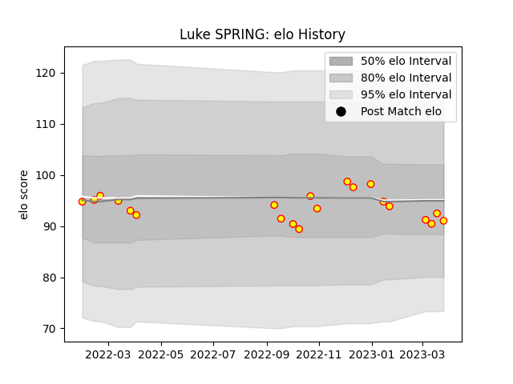

---  
layout: page  
title: Luke SPRING  
date: 2023-03-30 11:33:52.270066  
categories: player  
---
# Luke SPRING

Last updated: 2023-03-30
## Positions: P

## Current elo: 91.0

## Current Percentile: 62.0

# Elo History

# Match History

| Team     |   Appearances |   Win Rate |
|:---------|--------------:|-----------:|
| Richmond |            21 |   0.214286 |

| Opponent            |   Matches |   Win Rate |
|:--------------------|----------:|-----------:|
| Ealing Trailfinders |         3 |       0    |
| Jersey              |         3 |       0    |
| Ampthill            |         2 |       0.25 |
| Bedford             |         2 |       0.5  |
| Caldy               |         2 |       0    |
| Doncaster           |         2 |       0    |
| Hartpury College    |         2 |       1    |
| Nottingham          |         2 |       0    |
| Cornish Pirates     |         1 |       0    |
| Coventry            |         1 |       0    |
| London Scottish     |         1 |       1    |