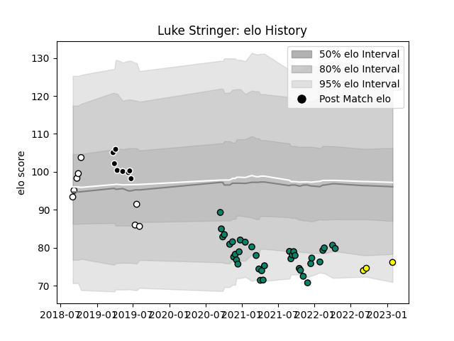

---  
layout: page  
title: Luke Stringer  
date: 2023-01-30 11:45:16.562686  
categories: player  
---
# Luke Stringer

## Positions: FL

## Current elo: 76.0

## Current Percentile: 7.0

# Elo History

# Match History

| Team         |   Appearances |   Win Rate |
|:-------------|--------------:|-----------:|
| Montauban    |            36 |   0.458333 |
| Natal Sharks |             8 |   0.625    |
| Sharks       |             8 |   0.375    |
| Albi         |             3 |   0.333333 |

| Opponent                   |   Matches |   Win Rate |
|:---------------------------|----------:|-----------:|
| Vannes                     |         3 |   0        |
| Provence Rugby             |         3 |   0.333333 |
| Carcassonne                |         3 |   0.333333 |
| Oyonnax                    |         3 |   0.333333 |
| Colomiers                  |         3 |   0.333333 |
| Agen                       |         2 |   0.5      |
| Griquas                    |         2 |   0.5      |
| Valence Romans Drome Rugby |         2 |   0.5      |
| Soyaux-Angouleme           |         2 |   1        |
| Rouen                      |         2 |   0.5      |
| Pumas                      |         2 |   0.5      |
| Narbonne                   |         2 |   1        |
| Mont-de-Marsan             |         2 |   1        |
| Aurillac                   |         2 |   0.5      |
| Jaguares                   |         2 |   0        |
| Western Province           |         2 |   0.5      |
| Bayonne                    |         2 |   0        |
| Beziers                    |         2 |   0.5      |
| Brumbies                   |         1 |   0        |
| US Bressane                |         1 |   1        |
| Stormers                   |         1 |   1        |
| Biarritz Olympique         |         1 |   1        |
| Blagnac                    |         1 |   0        |
| Grenoble                   |         1 |   0.5      |
| Golden Lions               |         1 |   1        |
| Carqueiranne-Hyères        |         1 |   0        |
| Nevers                     |         1 |   0        |
| Chiefs                     |         1 |   0        |
| Free State Cheetahs        |         1 |   1        |
| Melbourne Rebels           |         1 |   1        |
| Lions                      |         1 |   1        |
| Bulls                      |         1 |   0        |