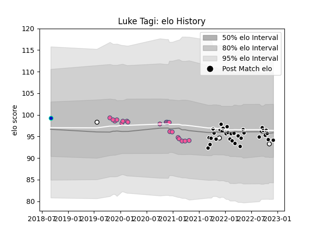

---  
layout: page  
title: Luke Tagi  
date: 2022-12-18 16:12:20.686316  
categories: player  
---
# Luke Tagi

## Positions: P

## Country: Fiji

## Current elo: 94.0

## Current Percentile: 40.0

# Elo History

# Match History

| Team                 |   Appearances |   Win Rate |
|:---------------------|--------------:|-----------:|
| Provence Rugby       |            35 |   0.6      |
| Stade Francais Paris |            20 |   0.35     |
| Fiji                 |             3 |   0.166667 |
| Fijian Drua          |             1 |   1        |

| Opponent            |   Matches |   Win Rate |
|:--------------------|----------:|-----------:|
| Agen                |         5 |   0.4      |
| Bayonne             |         3 |   0.333333 |
| Rouen               |         3 |   0.333333 |
| Oyonnax             |         3 |   0.5      |
| Carcassonne         |         3 |   1        |
| Montauban           |         3 |   1        |
| La Rochelle         |         2 |   1        |
| US Bressane         |         2 |   0.75     |
| Pau                 |         2 |   0.5      |
| Nevers              |         2 |   0.5      |
| Narbonne            |         2 |   0        |
| Mont-de-Marsan      |         2 |   0.5      |
| Aurillac            |         2 |   0.5      |
| Zebre               |         2 |   0.5      |
| Grenoble            |         2 |   1        |
| Colomiers           |         2 |   0.5      |
| Beziers             |         2 |   1        |
| Bordeaux Begles     |         2 |   0.5      |
| Lyon                |         1 |   0        |
| Racing 92           |         1 |   0        |
| Vannes              |         1 |   0        |
| Benetton Treviso    |         1 |   0        |
| Toulon              |         1 |   1        |
| Soyaux-Angouleme    |         1 |   1        |
| Scotland            |         1 |   0        |
| Bristol Rugby       |         1 |   0        |
| Massy               |         1 |   0        |
| New Zealand Maori   |         1 |   0        |
| Brive               |         1 |   0        |
| Clermont Auvergne   |         1 |   0        |
| Montpellier Herault |         1 |   0        |
| Georgia             |         1 |   0.5      |
| Melbourne Rising    |         1 |   1        |