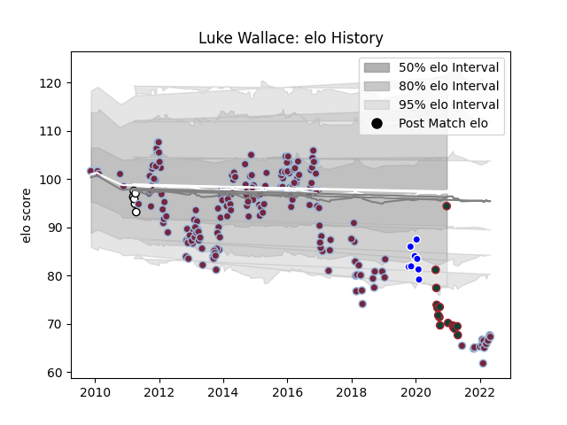

---  
layout: page  
title: Luke Wallace  
date: 2023-03-17 17:43:33.449038  
categories: player  
---
# Luke Wallace

## Positions: FL

## Current elo: 93.0

## Current Percentile: 2.0

# Elo History

# Match History

| Team             |   Appearances |   Win Rate |
|:-----------------|--------------:|-----------:|
| Harlequins       |           193 |   0.549223 |
| Leicester Tigers |            16 |   0.375    |
| Coventry         |             8 |   0.5625   |
| Esher            |             6 |   0.666667 |

| Opponent             |   Matches |   Win Rate |
|:---------------------|----------:|-----------:|
| Bath Rugby           |        19 |   0.578947 |
| Sale Sharks          |        19 |   0.526316 |
| Gloucester Rugby     |        18 |   0.527778 |
| Northampton Saints   |        17 |   0.352941 |
| London Irish         |        14 |   0.857143 |
| Exeter Chiefs        |        14 |   0.357143 |
| Saracens             |        14 |   0.142857 |
| Wasps                |        13 |   0.615385 |
| Leicester Tigers     |        12 |   0.5      |
| Worcester Warriors   |         9 |   0.666667 |
| Newcastle Falcons    |         9 |   0.611111 |
| Bristol Rugby        |         6 |   0.333333 |
| Montpellier Herault  |         3 |   0.333333 |
| Connacht             |         3 |   0.666667 |
| Racing 92            |         3 |   0.666667 |
| London Welsh         |         3 |   1        |
| Stade Francais Paris |         3 |   0.666667 |
| Plymouth             |         2 |   1        |
| Pertemps Bees        |         2 |   1        |
| Ospreys              |         2 |   1        |
| Scarlets             |         2 |   0.5      |
| Moseley              |         2 |   0        |
| Stade Toulousain     |         2 |   0.5      |
| Toulon               |         2 |   0        |
| Leinster             |         2 |   0.5      |
| Zebre                |         2 |   1        |
| Clermont Auvergne    |         2 |   0        |
| Bayonne              |         2 |   0.5      |
| Grenoble             |         2 |   1        |
| Edinburgh            |         2 |   0        |
| Castres Olympique    |         2 |   1        |
| Cardiff Blues        |         1 |   1        |
| Bedford              |         1 |   0        |
| Benetton Treviso     |         1 |   1        |
| Timisoara Saracens   |         1 |   1        |
| Biarritz Olympique   |         1 |   1        |
| Calvisano            |         1 |   1        |
| Sharks               |         1 |   1        |
| London Scottish      |         1 |   1        |
| Ampthill             |         1 |   0        |
| Cornish Pirates      |         1 |   1        |
| Doncaster            |         1 |   1        |
| Ealing Trailfinders  |         1 |   0.5      |
| Nottingham           |         1 |   1        |
| Harlequins           |         1 |   0        |
| Jersey               |         1 |   0        |
| Agen                 |         1 |   1        |