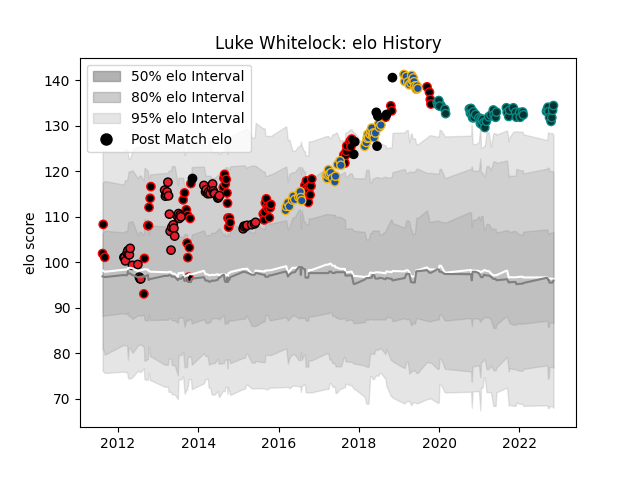

---  
layout: page  
title: Luke Whitelock  
date: 2022-11-16 11:31:35.557062  
categories: player  
---
# Luke Whitelock

## Positions: N8, FL

## Country: New Zealand

## Current elo: 115.0

## Current Percentile: 92.0

# Elo History

# Match History

| Team        |   Appearances |   Win Rate |
|:------------|--------------:|-----------:|
| Canterbury  |            58 |   0.793103 |
| Crusaders   |            53 |   0.641509 |
| Highlanders |            53 |   0.622642 |
| Pau         |            49 |   0.428571 |
| New Zealand |             7 |   1        |

| Opponent                 |   Matches |   Win Rate |
|:-------------------------|----------:|-----------:|
| Hurricanes               |        15 |   0.333333 |
| Chiefs                   |        14 |   0.392857 |
| Blues                    |        11 |   0.818182 |
| Auckland                 |         8 |   0.75     |
| Tasman                   |         7 |   0.571429 |
| Lions                    |         7 |   0.714286 |
| Crusaders                |         6 |   0.333333 |
| Highlanders              |         6 |   0.833333 |
| Melbourne Rebels         |         6 |   0.666667 |
| North Harbour            |         6 |   0.833333 |
| Otago                    |         6 |   1        |
| Counties Manukau         |         6 |   0.833333 |
| Montpellier Herault      |         5 |   0.6      |
| Lyon                     |         5 |   0.5      |
| New South Wales Waratahs |         5 |   0.6      |
| Taranaki                 |         5 |   0.8      |
| La Rochelle              |         5 |   0.2      |
| Queensland Reds          |         5 |   0.8      |
| Stormers                 |         5 |   0.8      |
| Brumbies                 |         5 |   1        |
| Bulls                    |         5 |   0.7      |
| France                   |         4 |   1        |
| Toulon                   |         4 |   0.125    |
| Wellington               |         4 |   0.5      |
| Bordeaux Begles          |         4 |   0.5      |
| Clermont Auvergne        |         4 |   0.25     |
| Castres Olympique        |         3 |   0        |
| Northland                |         3 |   1        |
| Stade Toulousain         |         3 |   0.333333 |
| Stade Francais Paris     |         3 |   0.333333 |
| Southland                |         3 |   0.666667 |
| Sharks                   |         3 |   0        |
| Cheetahs                 |         3 |   1        |
| Western Force            |         3 |   0.666667 |
| Hawke's Bay              |         3 |   1        |
| Waikato                  |         3 |   1        |
| Brive                    |         3 |   0.333333 |
| Manawatu                 |         3 |   0.666667 |
| Perpignan                |         2 |   1        |
| Racing 92                |         2 |   0        |
| Southern Kings           |         2 |   1        |
| Sunwolves                |         2 |   1        |
| Jaguares                 |         2 |   1        |
| Bayonne                  |         2 |   1        |
| Wales                    |         1 |   1        |
| Agen                     |         1 |   1        |
| Argentina                |         1 |   1        |
| Japan                    |         1 |   1        |
| Cardiff Blues            |         1 |   1        |
| British and Irish Lions  |         1 |   1        |
| Biarritz Olympique       |         1 |   1        |
| Bay of Plenty            |         1 |   1        |
| Leicester Tigers         |         1 |   1        |