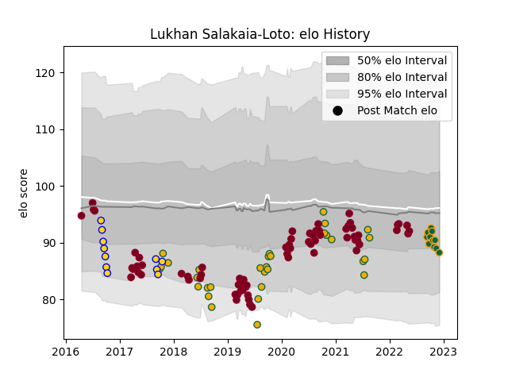

---  
layout: page  
title: Lukhan Salakaia-Loto  
date: 2023-03-17 17:26:40.238528  
categories: player  
---
# Lukhan Salakaia-Loto

## Positions: L, FL

## Country: Australia

## Current elo: 82.0

## Current Percentile: 15.0

# Elo History

# Match History

| Team               |   Appearances |   Win Rate |
|:-------------------|--------------:|-----------:|
| Queensland Reds    |            69 |   0.398551 |
| Australia          |            31 |   0.435484 |
| Northampton Saints |            20 |   0.4      |
| Brisbane City      |            11 |   0.454545 |

| Opponent                 |   Matches |   Win Rate |
|:-------------------------|----------:|-----------:|
| New Zealand              |        11 |   0.227273 |
| Brumbies                 |        11 |   0.454545 |
| Melbourne Rebels         |        11 |   0.590909 |
| New South Wales Waratahs |         8 |   0.375    |
| Western Force            |         6 |   0.666667 |
| Chiefs                   |         5 |   0.2      |
| Sunwolves                |         4 |   1        |
| Argentina                |         4 |   0.625    |
| Blues                    |         4 |   0        |
| Crusaders                |         3 |   0        |
| South Africa             |         3 |   0.5      |
| France                   |         3 |   0.666667 |
| Bulls                    |         3 |   0.333333 |
| Highlanders              |         3 |   0        |
| Ireland                  |         3 |   0.333333 |
| Jaguares                 |         3 |   0        |
| Bath Rugby               |         2 |   0.5      |
| Sharks                   |         2 |   0.5      |
| Queensland Country       |         2 |   0.5      |
| Bristol Rugby            |         2 |   0.5      |
| Melbourne Rising         |         2 |   0.5      |
| Canberra Vikings         |         2 |   0.5      |
| Munster                  |         2 |   0        |
| Lions                    |         2 |   0        |
| Hurricanes               |         2 |   0        |
| Harlequins               |         2 |   0.5      |
| Exeter Chiefs            |         2 |   0.5      |
| Gloucester Rugby         |         2 |   0.5      |
| La Rochelle              |         2 |   0        |
| Saracens                 |         1 |   0        |
| Wasps                    |         1 |   1        |
| Wales                    |         1 |   0        |
| Uruguay                  |         1 |   1        |
| Stormers                 |         1 |   1        |
| Southern Kings           |         1 |   1        |
| Fiji                     |         1 |   1        |
| Fijian Drua              |         1 |   1        |
| Scotland                 |         1 |   0        |
| Leicester Tigers         |         1 |   0        |
| Samoa                    |         1 |   1        |
| Georgia                  |         1 |   1        |
| Perth Spirit             |         1 |   0        |
| North Harbour Rays       |         1 |   0        |
| Newcastle Falcons        |         1 |   1        |
| Greater Sydney Rams      |         1 |   1        |
| NSW Country Eagles       |         1 |   0        |
| England                  |         1 |   0        |
| London Irish             |         1 |   1        |
| Sale Sharks              |         1 |   0        |