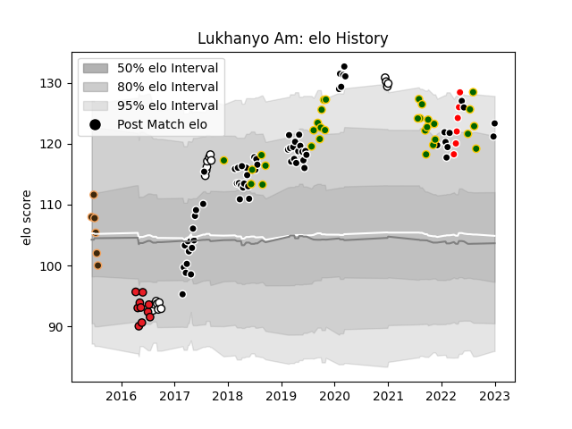

---  
layout: page  
title: Lukhanyo Am  
date: 2023-01-06 00:25:16.519785  
categories: player  
---
# Lukhanyo Am

## Positions: C

## Country: South Africa

## Current elo: 123.0

## Current Percentile: 90.0

# Elo History

# Match History

| Team                  |   Appearances |   Win Rate |
|:----------------------|--------------:|-----------:|
| Sharks                |            64 |   0.5625   |
| South Africa          |            31 |   0.66129  |
| Natal Sharks          |            18 |   0.722222 |
| Southern Kings        |            10 |   0.1      |
| Border Bulldogs       |             6 |   0.333333 |
| Kobelco Kobe Steelers |             6 |   0.5      |

| Opponent                          |   Matches |   Win Rate |
|:----------------------------------|----------:|-----------:|
| Lions                             |        11 |   0.454545 |
| Bulls                             |        10 |   0.4      |
| Jaguares                          |         9 |   0.555556 |
| Stormers                          |         9 |   0.5      |
| New Zealand                       |         7 |   0.5      |
| Wales                             |         5 |   0.8      |
| Griquas                           |         4 |   1        |
| England                           |         4 |   0.75     |
| Argentina                         |         4 |   0.75     |
| Pumas                             |         3 |   1        |
| Brumbies                          |         3 |   0.333333 |
| Australia                         |         3 |   0        |
| British and Irish Lions           |         3 |   0.666667 |
| Free State Cheetahs               |         3 |   0.333333 |
| Golden Lions                      |         3 |   0.333333 |
| Sunwolves                         |         3 |   1        |
| Melbourne Rebels                  |         3 |   0.5      |
| Blues                             |         3 |   0.666667 |
| Highlanders                       |         3 |   0.666667 |
| Hurricanes                        |         3 |   0        |
| Blue Bulls                        |         3 |   1        |
| New South Wales Waratahs          |         3 |   0.833333 |
| Queensland Reds                   |         2 |   0.5      |
| Southern Kings                    |         2 |   0.5      |
| Japan                             |         2 |   1        |
| Crusaders                         |         2 |   0.25     |
| Chiefs                            |         2 |   0.5      |
| Cheetahs                          |         2 |   0.5      |
| Western Province                  |         2 |   0.5      |
| Toshiba Brave Lupus Tokyo         |         1 |   0        |
| Ulster                            |         1 |   0        |
| Sharks                            |         1 |   0        |
| Valke                             |         1 |   0        |
| Western Force                     |         1 |   1        |
| Urayasu D-Rocks                   |         1 |   1        |
| Kubota Spears Funabashi Tokyo-Bay |         1 |   0        |
| Scotland                          |         1 |   1        |
| Saitama Wild Knights              |         1 |   0        |
| SWD Eagles                        |         1 |   0        |
| Namibia                           |         1 |   1        |
| Leopards                          |         1 |   0        |
| Italy                             |         1 |   1        |
| Griffons                          |         1 |   0        |
| Green Rockets Tokatsu             |         1 |   1        |
| Eastern Province Kings            |         1 |   1        |
| Boland Cavaliers                  |         1 |   1        |
| Benetton Treviso                  |         1 |   1        |
| Yokohama Canon Eagles             |         1 |   1        |