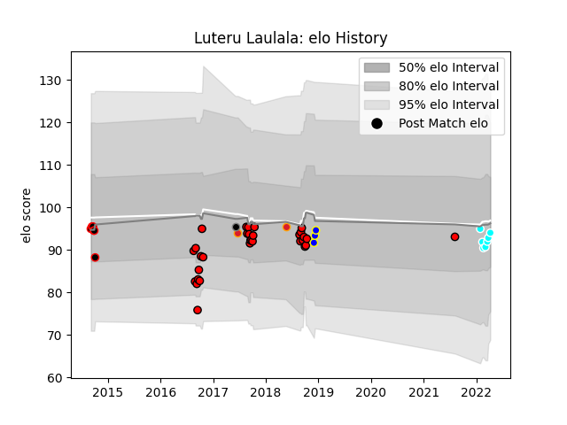

---  
layout: page  
title: Luteru Laulala  
date: 2023-02-24 02:21:33.755127  
categories: player  
---
# Luteru Laulala

## Positions: FB, FH

## Country: Chiefs

## Current elo: 94.0

## Current Percentile: 42.0

# Elo History

# Match History

| Team                             |   Appearances |   Win Rate |
|:---------------------------------|--------------:|-----------:|
| Counties Manukau                 |            31 |   0.435484 |
| Toyota Industries Shuttles Aichi |             7 |   1        |
| Canterbury                       |             6 |   0.5      |
| Urayasu D-Rocks                  |             3 |   0.666667 |
| Chiefs                           |             2 |   0        |
| Provincial Union XV              |             1 |   0        |

| Opponent                          |   Matches |   Win Rate |
|:----------------------------------|----------:|-----------:|
| North Harbour                     |         4 |   0        |
| Tasman                            |         4 |   0.25     |
| Canterbury                        |         4 |   0.25     |
| Hawke's Bay                       |         3 |   1        |
| Taranaki                          |         3 |   0        |
| Bay of Plenty                     |         3 |   0.5      |
| Wellington                        |         3 |   0.333333 |
| Kyuden Voltex                     |         2 |   1        |
| Manawatu                          |         2 |   0.5      |
| Northland                         |         2 |   0.5      |
| Otago                             |         2 |   1        |
| Shimizu Blue Sharks               |         2 |   1        |
| Southland                         |         2 |   0.5      |
| Chugoku Red Regulions             |         2 |   1        |
| British and Irish Lions           |         2 |   0        |
| Waikato                           |         2 |   0.5      |
| Auckland                          |         2 |   1        |
| Kubota Spears Funabashi Tokyo-Bay |         1 |   1        |
| Kurita Water Gush                 |         1 |   1        |
| Counties Manukau                  |         1 |   1        |
| Saitama Wild Knights              |         1 |   1        |
| Sharks                            |         1 |   0        |
| Shizuoka Blue Revs                |         1 |   0        |