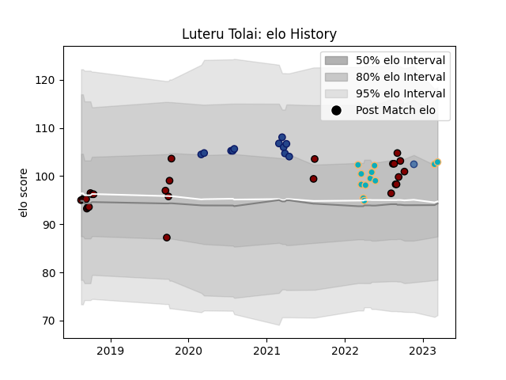

---  
layout: page  
title: Luteru Tolai  
date: 2022-11-22 11:39:16.525317  
categories: player  
---
# Luteru Tolai

## Positions: H

## Country: Samoa

## Current elo: 92.0

## Current Percentile: 30.0

# Elo History

# Match History

| Team           |   Appearances |   Win Rate |
|:---------------|--------------:|-----------:|
| North Harbour  |            26 |   0.5      |
| Blues          |            11 |   0.636364 |
| Moana Pasifika |            10 |   0        |
| Samoa          |             1 |   1        |

| Opponent                 |   Matches |   Win Rate |
|:-------------------------|----------:|-----------:|
| Highlanders              |         4 |   0.5      |
| Chiefs                   |         4 |   0.25     |
| Counties Manukau         |         3 |   1        |
| Tasman                   |         3 |   0.333333 |
| Hurricanes               |         3 |   0.666667 |
| Auckland                 |         3 |   0        |
| Canterbury               |         3 |   0        |
| Crusaders                |         2 |   0        |
| Hawke's Bay              |         2 |   0.5      |
| Wellington               |         2 |   0.5      |
| Manawatu                 |         2 |   1        |
| Bay of Plenty            |         2 |   0.5      |
| Waikato                  |         2 |   0.5      |
| Northland                |         2 |   1        |
| Blues                    |         2 |   0        |
| Stormers                 |         1 |   1        |
| Taranaki                 |         1 |   1        |
| Melbourne Rebels         |         1 |   0        |
| Romania                  |         1 |   1        |
| Queensland Reds          |         1 |   0        |
| Otago                    |         1 |   0        |
| New South Wales Waratahs |         1 |   0        |
| Lions                    |         1 |   1        |
| Western Force            |         1 |   0        |