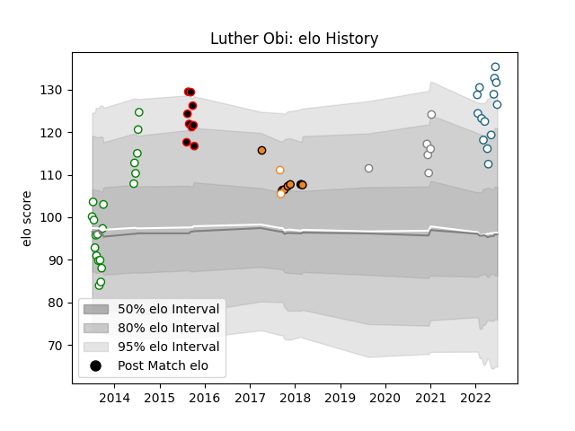

---  
layout: page  
title: Luther Obi  
date: 2023-03-16 19:56:39.723372  
categories: player  
---
# Luther Obi

## Positions: W

## Current elo: 126.0

## Current Percentile: 96.0

# Elo History

# Match History

| Team                   |   Appearances |   Win Rate |
|:-----------------------|--------------:|-----------:|
| Leopards               |            20 |   0.6      |
| Griquas                |            14 |   0.571429 |
| Cheetahs               |             9 |   0.444444 |
| Eastern Province Kings |             9 |   0.222222 |
| Pumas                  |             6 |   0.333333 |
| Free State Cheetahs    |             2 |   0        |

| Opponent               |   Matches |   Win Rate |
|:-----------------------|----------:|-----------:|
| Pumas                  |         7 |   0.285714 |
| Blue Bulls             |         5 |   0.4      |
| Western Province       |         5 |   0.4      |
| Free State Cheetahs    |         5 |   0.4      |
| Natal Sharks           |         5 |   0        |
| Golden Lions           |         4 |   0.5      |
| Griffons               |         3 |   0.666667 |
| Valke                  |         3 |   1        |
| SWD Eagles             |         3 |   0.666667 |
| Griquas                |         3 |   0.666667 |
| Eastern Province Kings |         3 |   0.333333 |
| Border Bulldogs        |         3 |   0.666667 |
| Boland Cavaliers       |         2 |   1        |
| Glasgow Warriors       |         2 |   0        |
| Connacht               |         2 |   0.5      |
| Leinster               |         1 |   1        |
| Ospreys                |         1 |   0        |
| Edinburgh              |         1 |   1        |
| Stormers               |         1 |   0        |
| Zebre                  |         1 |   1        |