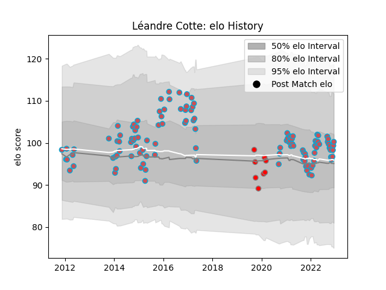

---  
layout: page  
title: Léandre Cotte  
date: 2023-02-02 18:58:01.465220  
categories: player  
---
# Léandre Cotte

## Positions: L

## Current elo: 79.0

## Current Percentile: 13.0

# Elo History

# Match History

| Team             |   Appearances |   Win Rate |
|:-----------------|--------------:|-----------:|
| Bourgoin-Jallieu |           147 |   0.428571 |
| Roval Drome XV   |             8 |   0        |

| Opponent                   |   Matches |   Win Rate |
|:---------------------------|----------:|-----------:|
| Dax                        |        15 |   0.533333 |
| Albi                       |        12 |   0.166667 |
| Narbonne                   |         9 |   0.388889 |
| Tarbes                     |         9 |   0.444444 |
| Beziers                    |         7 |   0.285714 |
| Massy                      |         6 |   0.333333 |
| Mont-de-Marsan             |         6 |   0.666667 |
| Aurillac                   |         6 |   0.416667 |
| Carcassonne                |         6 |   0.5      |
| Colomiers                  |         6 |   0.5      |
| Chambery                   |         5 |   0.6      |
| Nice                       |         5 |   0.6      |
| Biarritz Olympique         |         5 |   0.2      |
| Dijon                      |         4 |   0.75     |
| Soyaux-Angouleme           |         4 |   0        |
| Montauban                  |         4 |   0.25     |
| Pau                        |         4 |   0        |
| Cognac Saint Jean d'Angély |         4 |   0.75     |
| Oyonnax                    |         3 |   0.333333 |
| Provence Rugby             |         3 |   0.666667 |
| US Bressane                |         3 |   0        |
| Valence Romans Drome Rugby |         3 |   0.5      |
| Aubenas                    |         3 |   0.333333 |
| Suresnes                   |         2 |   0.5      |
| Perpignan                  |         2 |   0        |
| Agen                       |         2 |   1        |
| Lyon                       |         2 |   0.5      |
| La Rochelle                |         2 |   0        |
| Carqueiranne-Hyères        |         2 |   1        |
| Blagnac                    |         2 |   0.5      |
| Vannes                     |         2 |   0.25     |
| Nevers                     |         1 |   0        |
| Périgueux                  |         1 |   1        |
| Rennes                     |         1 |   1        |
| Rouen                      |         1 |   0        |
| Grenoble                   |         1 |   0        |
| Bayonne                    |         1 |   0        |
| Auch                       |         1 |   0        |