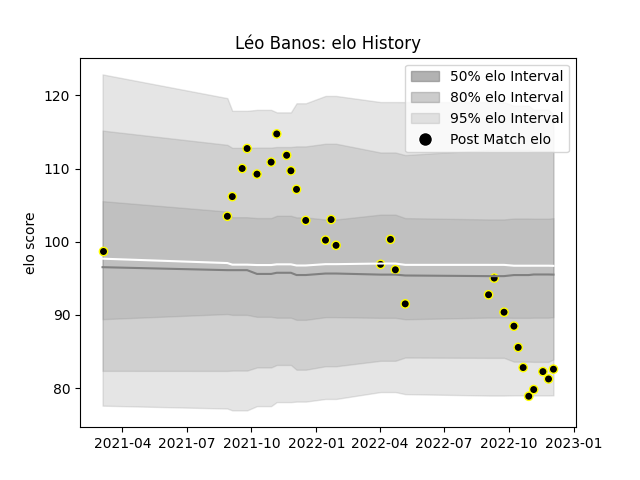

---  
layout: page  
title: Léo Banos  
date: 2022-12-14 11:30:57.031432  
categories: player  
---
# Léo Banos

## Positions: FL

## Current elo: 85.0

## Current Percentile: 7.0

# Elo History

# Match History

| Team           |   Appearances |   Win Rate |
|:---------------|--------------:|-----------:|
| Mont-de-Marsan |            31 |   0.645161 |

| Opponent           |   Matches |   Win Rate |
|:-------------------|----------:|-----------:|
| Vannes             |         4 |   0.5      |
| Beziers            |         3 |   0.666667 |
| Nevers             |         3 |   0.666667 |
| Colomiers          |         3 |   0.666667 |
| Narbonne           |         2 |   1        |
| Provence Rugby     |         2 |   0.5      |
| Agen               |         2 |   0.5      |
| Grenoble           |         2 |   1        |
| Bayonne            |         2 |   1        |
| Massy              |         1 |   0        |
| Aurillac           |         1 |   1        |
| Biarritz Olympique |         1 |   1        |
| Oyonnax            |         1 |   0        |
| Rouen              |         1 |   0        |
| Soyaux-Angouleme   |         1 |   1        |
| US Bressane        |         1 |   1        |
| Montauban          |         1 |   0        |