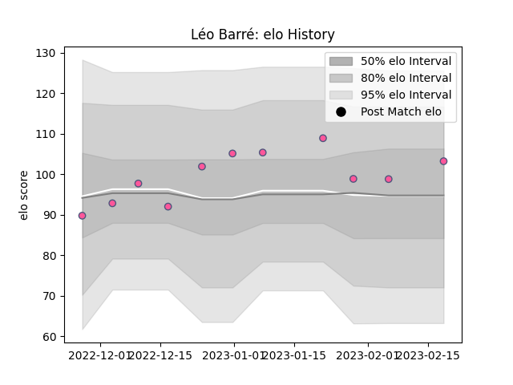

---  
layout: page  
title: Léo Barré  
date: 2023-02-24 02:33:57.601881  
categories: player  
---
# Léo Barré

## Positions: FB, FH

## Current elo: 103.0

## Current Percentile: 59.0

# Elo History

# Match History

| Team                 |   Appearances |   Win Rate |
|:---------------------|--------------:|-----------:|
| Stade Francais Paris |            11 |   0.545455 |

| Opponent          |   Matches |   Win Rate |
|:------------------|----------:|-----------:|
| Benetton Treviso  |         2 |        0.5 |
| Bayonne           |         1 |        0   |
| Bordeaux Begles   |         1 |        1   |
| Castres Olympique |         1 |        1   |
| La Rochelle       |         1 |        1   |
| Lions             |         1 |        0   |
| Pau               |         1 |        1   |
| Perpignan         |         1 |        0   |
| Racing 92         |         1 |        1   |
| Toulon            |         1 |        0   |