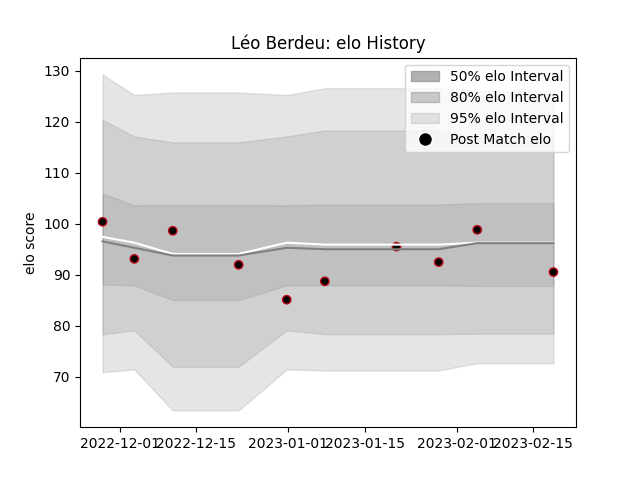

---  
layout: page  
title: Léo Berdeu  
date: 2023-02-24 02:22:03.690948  
categories: player  
---
# Léo Berdeu

## Positions: FH, FB

## Current elo: 91.0

## Current Percentile: 59.0

# Elo History

# Match History

| Team   |   Appearances |   Win Rate |
|:-------|--------------:|-----------:|
| Lyon   |            10 |        0.6 |

| Opponent            |   Matches |   Win Rate |
|:--------------------|----------:|-----------:|
| Bulls               |         2 |        0.5 |
| Bayonne             |         1 |        0   |
| Brive               |         1 |        0   |
| Clermont Auvergne   |         1 |        1   |
| La Rochelle         |         1 |        1   |
| Montpellier Herault |         1 |        1   |
| Pau                 |         1 |        1   |
| Stade Toulousain    |         1 |        1   |
| Toulon              |         1 |        0   |