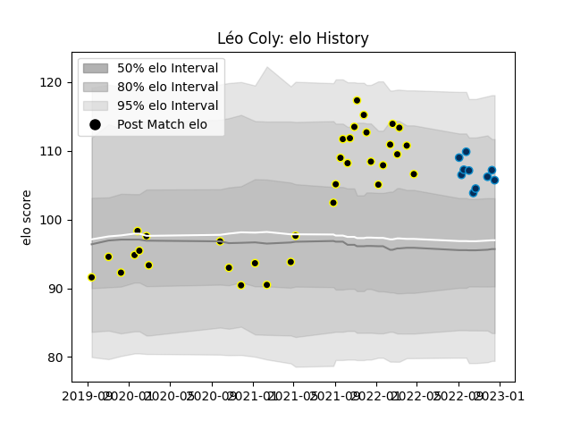

---  
layout: page  
title: Léo Coly  
date: 2022-12-14 11:23:37.286100  
categories: player  
---
# Léo Coly

## Positions: SH

## Current elo: 107.0

## Current Percentile: 81.0

# Elo History

# Match History

| Team                |   Appearances |   Win Rate |
|:--------------------|--------------:|-----------:|
| Mont-de-Marsan      |            34 |   0.705882 |
| Montpellier Herault |             9 |   0.555556 |

| Opponent         |   Matches |   Win Rate |
|:-----------------|----------:|-----------:|
| Colomiers        |         4 |   0.5      |
| Oyonnax          |         4 |   0.25     |
| Montauban        |         3 |   0.333333 |
| Bayonne          |         3 |   1        |
| Beziers          |         3 |   0.666667 |
| Rouen            |         3 |   1        |
| Narbonne         |         2 |   1        |
| US Bressane      |         2 |   1        |
| Provence Rugby   |         2 |   1        |
| Nevers           |         2 |   0.5      |
| Vannes           |         2 |   0.5      |
| Lyon             |         1 |   0        |
| Aurillac         |         1 |   1        |
| London Irish     |         1 |   1        |
| La Rochelle      |         1 |   0        |
| Pau              |         1 |   1        |
| Perpignan        |         1 |   1        |
| Carcassonne      |         1 |   1        |
| Racing 92        |         1 |   0        |
| Brive            |         1 |   1        |
| Soyaux-Angouleme |         1 |   1        |
| Stade Toulousain |         1 |   0        |
| Bordeaux Begles  |         1 |   1        |
| Agen             |         1 |   1        |