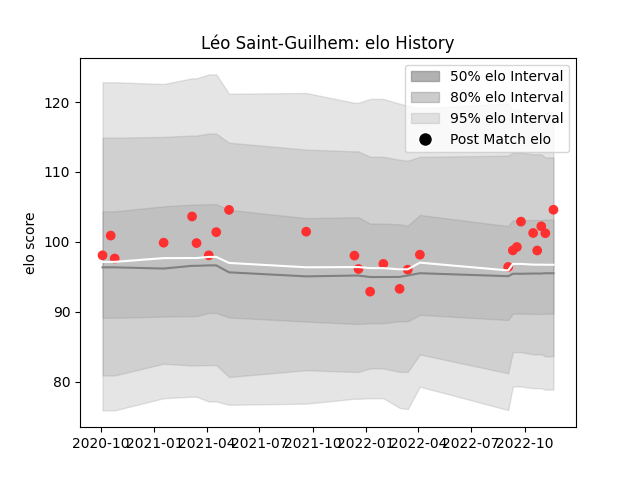

---  
layout: page  
title: Léo Saint-Guilhem  
date: 2022-11-22 11:38:29.300728  
categories: player  
---
# Léo Saint-Guilhem

## Positions: FL, L

## Current elo: 105.0

## Current Percentile: 70.0

# Elo History

# Match History

| Team   |   Appearances |   Win Rate |
|:-------|--------------:|-----------:|
| Tarbes |            26 |   0.423077 |

| Opponent                   |   Matches |   Win Rate |
|:---------------------------|----------:|-----------:|
| Blagnac                    |         3 |   0.333333 |
| Cognac Saint Jean d'Angély |         3 |   0.833333 |
| Suresnes                   |         3 |   0.333333 |
| Albi                       |         2 |   0.5      |
| Aubenas                    |         2 |   0.5      |
| Dax                        |         2 |   0        |
| Dijon                      |         2 |   0.25     |
| Nice                       |         2 |   0        |
| Bourgoin-Jallieu           |         1 |   1        |
| Chambery                   |         1 |   0        |
| Massy                      |         1 |   0        |
| Narbonne                   |         1 |   1        |
| Rennes                     |         1 |   1        |
| Soyaux-Angouleme           |         1 |   0        |
| US Bressane                |         1 |   1        |