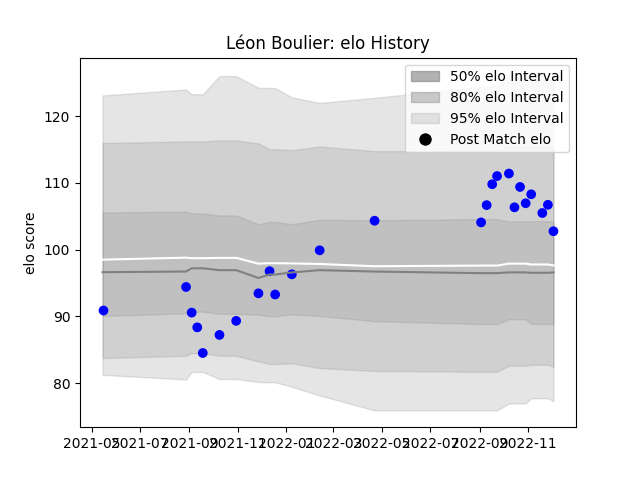

---  
layout: page  
title: Léon Boulier  
date: 2022-11-22 11:32:00.408945  
categories: player  
---
# Léon Boulier

## Positions: N8

## Current elo: 105.0

## Current Percentile: 80.0

# Elo History

# Match History

| Team   |   Appearances |   Win Rate |
|:-------|--------------:|-----------:|
| Vannes |            23 |   0.478261 |

| Opponent           |   Matches |   Win Rate |
|:-------------------|----------:|-----------:|
| Nevers             |         3 |   0.666667 |
| Bayonne            |         2 |   0        |
| Beziers            |         2 |   1        |
| Colomiers          |         2 |   1        |
| Grenoble           |         2 |   0.5      |
| Oyonnax            |         2 |   0        |
| Agen               |         1 |   0        |
| Aurillac           |         1 |   0        |
| Biarritz Olympique |         1 |   1        |
| Carcassonne        |         1 |   1        |
| Massy              |         1 |   1        |
| Mont-de-Marsan     |         1 |   0        |
| Montauban          |         1 |   0        |
| Perpignan          |         1 |   0        |
| Rouen              |         1 |   0        |
| US Bressane        |         1 |   1        |