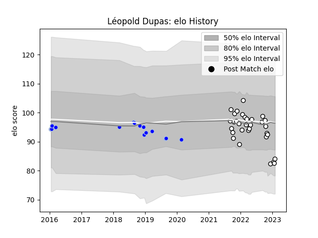

---  
layout: page  
title: Léopold Dupas  
date: 2022-12-18 16:13:12.311783  
categories: player  
---
# Léopold Dupas

## Positions: SH

## Current elo: 91.0

## Current Percentile: 43.0

# Elo History

# Match History

| Team                       |   Appearances |   Win Rate |
|:---------------------------|--------------:|-----------:|
| Valence Romans Drome Rugby |            22 |   0.659091 |
| Colomiers                  |             2 |   1        |

| Opponent                   |   Matches |   Win Rate |
|:---------------------------|----------:|-----------:|
| Cognac Saint Jean d'Angély |         3 |       1    |
| Suresnes                   |         3 |       1    |
| Albi                       |         2 |       0    |
| Blagnac                    |         2 |       1    |
| Bourgoin-Jallieu           |         2 |       0.25 |
| Chambery                   |         2 |       0.5  |
| Dax                        |         2 |       0.5  |
| Nice                       |         2 |       1    |
| Aubenas                    |         1 |       1    |
| Brive                      |         1 |       1    |
| Dijon                      |         1 |       0    |
| Grenoble                   |         1 |       1    |
| Massy                      |         1 |       0    |
| Narbonne                   |         1 |       1    |