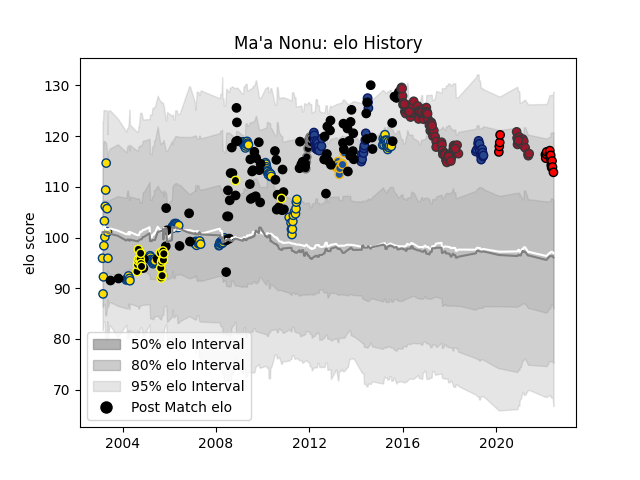

---  
layout: page  
title: Ma'a Nonu  
date: 2023-03-17 17:36:52.014587  
categories: player  
---
# Ma'a Nonu

## Positions: C

## Country: New Zealand

## Current elo: 113.0

## Current Percentile: 84.0

# Elo History

# Match History

| Team             |   Appearances |   Win Rate |
|:-----------------|--------------:|-----------:|
| Hurricanes       |           123 |   0.601626 |
| New Zealand      |            98 |   0.887755 |
| Toulon           |            94 |   0.542553 |
| Blues            |            39 |   0.371795 |
| Wellington       |            20 |   0.675    |
| San Diego Legion |            17 |   0.588235 |
| Black Rams Tokyo |            11 |   0.590909 |
| Highlanders      |             9 |   0.111111 |

| Opponent                        |   Matches |   Win Rate |
|:--------------------------------|----------:|-----------:|
| Australia                       |        25 |   0.84     |
| Crusaders                       |        20 |   0.125    |
| Highlanders                     |        17 |   0.529412 |
| South Africa                    |        17 |   0.764706 |
| Chiefs                          |        17 |   0.5      |
| France                          |        13 |   0.923077 |
| Blues                           |        13 |   0.653846 |
| Queensland Reds                 |        13 |   0.692308 |
| Bulls                           |        12 |   0.458333 |
| England                         |        12 |   0.833333 |
| Brumbies                        |        12 |   0.5      |
| Sharks                          |        11 |   0.409091 |
| Stormers                        |        10 |   0.6      |
| New South Wales Waratahs        |         9 |   0.444444 |
| Western Force                   |         9 |   0.888889 |
| Clermont Auvergne               |         8 |   0.125    |
| Argentina                       |         7 |   1        |
| Cheetahs                        |         7 |   0.714286 |
| Bordeaux Begles                 |         7 |   0.714286 |
| Racing 92                       |         7 |   0.428571 |
| Castres Olympique               |         6 |   0.666667 |
| Ireland                         |         6 |   1        |
| Stade Toulousain                |         6 |   0.5      |
| Wales                           |         6 |   1        |
| Pau                             |         5 |   1        |
| Montpellier Herault             |         5 |   0.4      |
| Lyon                            |         5 |   0.3      |
| Lions                           |         5 |   1        |
| Hurricanes                      |         5 |   0.2      |
| Agen                            |         5 |   0.8      |
| Bayonne                         |         4 |   0.25     |
| Cats                            |         4 |   1        |
| Seattle Seawolves               |         4 |   0.25     |
| Scarlets                        |         4 |   0.5      |
| Stade Francais Paris            |         4 |   0.5      |
| Bath Rugby                      |         4 |   0.75     |
| Brive                           |         4 |   0.5      |
| La Rochelle                     |         4 |   0.25     |
| Canterbury                      |         4 |   0.25     |
| Sale Sharks                     |         3 |   1        |
| Oyonnax                         |         3 |   0.666667 |
| Melbourne Rebels                |         3 |   0.333333 |
| Waikato                         |         3 |   1        |
| Grenoble                        |         3 |   0.833333 |
| Warathas                        |         3 |   0.666667 |
| Italy                           |         3 |   1        |
| North Harbour                   |         2 |   0.5      |
| Houston SaberCats               |         2 |   0.5      |
| Auckland                        |         2 |   0.5      |
| Saracens                        |         2 |   0        |
| Otago                           |         2 |   0.25     |
| Northland                       |         2 |   1        |
| Austin Gilgronis                |         2 |   0        |
| Taranaki                        |         2 |   1        |
| Dallas Jackals                  |         2 |   1        |
| Tonga                           |         2 |   1        |
| NOLA Gold                       |         2 |   1        |
| Scotland                        |         2 |   1        |
| Leinster                        |         2 |   1        |
| Southland                       |         2 |   1        |
| Bay of Plenty                   |         1 |   1        |
| Urayasu D-Rocks                 |         1 |   0.5      |
| Wasps                           |         1 |   1        |
| Utah Warriors                   |         1 |   1        |
| Shizuoka Blue Revs              |         1 |   0        |
| Toshiba Brave Lupus Tokyo       |         1 |   0        |
| Toyota Verblitz                 |         1 |   1        |
| Tokyo Sungoliath                |         1 |   0        |
| Hanazono Kintetsu Liners        |         1 |   1        |
| Samoa                           |         1 |   1        |
| Mie Honda Heat                  |         1 |   1        |
| Jaguares                        |         1 |   0        |
| Japan                           |         1 |   1        |
| Kobelco Kobe Steelers           |         1 |   1        |
| L. A. Giltinis                  |         1 |   1        |
| Colorado Raptors                |         1 |   1        |
| Coca-Cola Red Sparks            |         1 |   1        |
| Munster                         |         1 |   0        |
| Saitama Wild Knights            |         1 |   0        |
| NTT Docomo Red Hurricanes Osaka |         1 |   1        |
| Namibia                         |         1 |   1        |
| New England Free Jacks          |         1 |   1        |
| Canada                          |         1 |   1        |
| British and Irish Lions         |         1 |   1        |
| Rugby ATL                       |         1 |   0        |
| Benetton Treviso                |         1 |   1        |