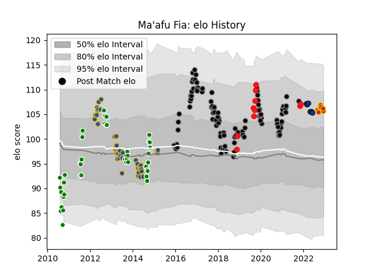

---  
layout: page  
title: Ma'afu Fia  
date: 2023-01-06 00:10:26.060542  
categories: player  
---
# Ma'afu Fia

## Positions: P

## Country: Tonga

## Current elo: 115.0

## Current Percentile: 89.0

# Elo History

# Match History

| Team        |   Appearances |   Win Rate |
|:------------|--------------:|-----------:|
| Ospreys     |           101 |   0.475248 |
| Manawatu    |            42 |   0.547619 |
| Highlanders |            40 |   0.475    |
| Tonga       |            10 |   0.1      |
| Perpignan   |             9 |   0.111111 |
| Bath Rugby  |             6 |   0.583333 |

| Opponent                 |   Matches |   Win Rate |
|:-------------------------|----------:|-----------:|
| Munster                  |         9 |   0.111111 |
| Dragons                  |         8 |   0.75     |
| Zebre                    |         7 |   0.714286 |
| Leinster                 |         7 |   0.285714 |
| Glasgow Warriors         |         7 |   0.357143 |
| Connacht                 |         7 |   0.571429 |
| Cardiff Blues            |         6 |   0.833333 |
| Hurricanes               |         6 |   0.666667 |
| Hawke's Bay              |         6 |   0.666667 |
| Ulster                   |         6 |   0        |
| Cheetahs                 |         6 |   0.5      |
| Scarlets                 |         6 |   0.166667 |
| Blues                    |         6 |   0.666667 |
| Southland                |         5 |   0.6      |
| Chiefs                   |         5 |   0.4      |
| North Harbour            |         5 |   0.6      |
| Tasman                   |         4 |   0.5      |
| Southern Kings           |         4 |   0.5      |
| Benetton Treviso         |         4 |   0.75     |
| Northland                |         4 |   0.75     |
| Otago                    |         4 |   0.5      |
| Saracens                 |         4 |   0.125    |
| Queensland Reds          |         4 |   0.25     |
| Edinburgh                |         4 |   0.75     |
| Crusaders                |         4 |   0        |
| Sharks                   |         4 |   0.5      |
| Clermont Auvergne        |         4 |   0.25     |
| Worcester Warriors       |         3 |   0.333333 |
| Counties Manukau         |         3 |   0.333333 |
| Waikato                  |         3 |   0.666667 |
| Lyon                     |         3 |   1        |
| Melbourne Rebels         |         3 |   0.666667 |
| Taranaki                 |         3 |   0.666667 |
| Pau                      |         2 |   0.5      |
| Racing 92                |         2 |   0        |
| Northampton Saints       |         2 |   1        |
| Newcastle Falcons        |         2 |   1        |
| La Rochelle              |         2 |   0        |
| Auckland                 |         2 |   0        |
| Stade Francais Paris     |         2 |   0.5      |
| Bristol Rugby            |         2 |   0.5      |
| England                  |         2 |   0        |
| Bulls                    |         2 |   1        |
| Western Force            |         1 |   0        |
| Wellington               |         1 |   0        |
| Stade Toulousain         |         1 |   0        |
| Stormers                 |         1 |   0        |
| Wales                    |         1 |   0        |
| United States of America |         1 |   1        |
| Argentina                |         1 |   0        |
| Sale Sharks              |         1 |   0.5      |
| Fiji                     |         1 |   0        |
| Bath Rugby               |         1 |   0        |
| Bay of Plenty            |         1 |   1        |
| Bayonne                  |         1 |   0        |
| Brumbies                 |         1 |   0        |
| Canterbury               |         1 |   0        |
| Castres Olympique        |         1 |   1        |
| France                   |         1 |   0        |
| Romania                  |         1 |   0        |
| Georgia                  |         1 |   0        |
| Gloucester Rugby         |         1 |   0        |
| Grenoble                 |         1 |   1        |
| Lions                    |         1 |   1        |
| Montpellier Herault      |         1 |   0        |
| New Zealand              |         1 |   0        |
| London Irish             |         1 |   1        |