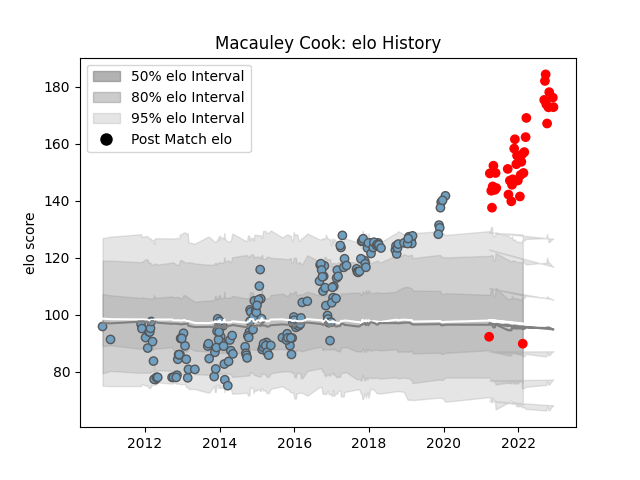

---  
layout: page  
title: Macauley Cook  
date: 2022-12-18 16:12:24.897548  
categories: player  
---
# Macauley Cook

## Positions: L, FL

## Current elo: 146.0

## Current Percentile: 99.0

# Elo History

# Match History

| Team          |   Appearances |   Win Rate |
|:--------------|--------------:|-----------:|
| Cardiff Blues |           177 |   0.488701 |
| Jersey        |            36 |   0.736111 |

| Opponent            |   Matches |   Win Rate |
|:--------------------|----------:|-----------:|
| Glasgow Warriors    |        16 |   0.1875   |
| Ospreys             |        14 |   0.214286 |
| Munster             |        13 |   0.307692 |
| Dragons             |        12 |   0.666667 |
| Edinburgh           |        11 |   0.818182 |
| Scarlets            |        11 |   0.272727 |
| Connacht            |        11 |   0.681818 |
| Zebre               |        10 |   0.7      |
| Benetton Treviso    |        10 |   0.75     |
| Leinster            |        10 |   0        |
| Ulster              |         9 |   0.444444 |
| Harlequins          |         4 |   0.5      |
| Lyon                |         4 |   1        |
| Montpellier Herault |         4 |   0.25     |
| Coventry            |         4 |   0.75     |
| Nottingham          |         4 |   1        |
| Doncaster           |         4 |   0.25     |
| Cornish Pirates     |         4 |   0.75     |
| Cheetahs            |         4 |   0.75     |
| Ampthill            |         4 |   0.875    |
| Pau                 |         3 |   1        |
| Richmond            |         3 |   1        |
| London Scottish     |         3 |   1        |
| Leicester Tigers    |         3 |   0        |
| Ealing Trailfinders |         3 |   0        |
| Calvisano           |         3 |   1        |
| Hartpury College    |         3 |   1        |
| Bedford             |         3 |   0.666667 |
| London Irish        |         2 |   0.5      |
| Grenoble            |         2 |   1        |
| Gloucester Rugby    |         2 |   0        |
| Exeter Chiefs       |         2 |   0.25     |
| Bristol Rugby       |         2 |   1        |
| Rovigo              |         2 |   1        |
| Saracens            |         2 |   0        |
| Wasps               |         2 |   1        |
| Stade Toulousain    |         2 |   1        |
| Toulon              |         2 |   0        |
| Bath Rugby          |         1 |   0        |
| Worcester Warriors  |         1 |   0        |
| Sale Sharks         |         1 |   1        |
| Southern Kings      |         1 |   1        |
| Caldy               |         1 |   1        |
| Aironi              |         1 |   1        |