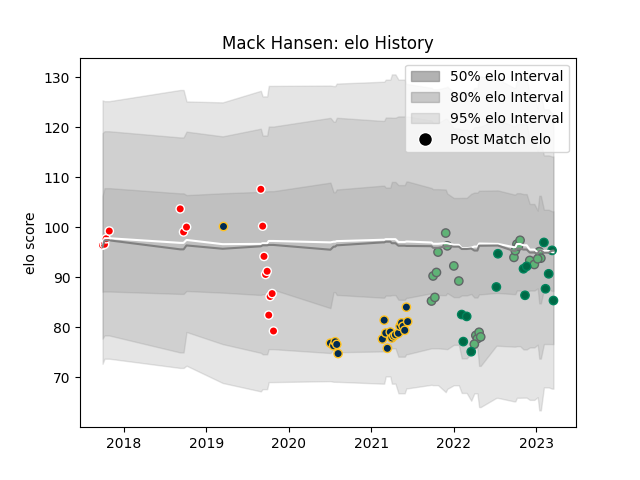

---  
layout: page  
title: Mack Hansen  
date: 2023-01-13 11:30:03.583314  
categories: player  
---
# Mack Hansen

## Positions: W

## Country: Ireland

## Current elo: 89.0

## Current Percentile: 31.0

# Elo History

# Match History

| Team             |   Appearances |   Win Rate |
|:-----------------|--------------:|-----------:|
| Brumbies         |            21 |   0.619048 |
| Connacht         |            20 |   0.5      |
| Canberra Vikings |            14 |   0.785714 |
| Ireland          |             9 |   0.888889 |

| Opponent                 |   Matches |   Win Rate |
|:-------------------------|----------:|-----------:|
| Western Force            |         5 |   0.8      |
| New South Wales Waratahs |         4 |   1        |
| Queensland Reds          |         4 |   0.25     |
| Melbourne Rebels         |         4 |   0.75     |
| Munster                  |         3 |   0.666667 |
| Sydney Rays              |         3 |   1        |
| Fijian Drua              |         3 |   0.666667 |
| Leinster                 |         2 |   0        |
| Ulster                   |         2 |   0.5      |
| Sharks                   |         2 |   0.5      |
| New Zealand              |         2 |   1        |
| NSW Country Eagles       |         2 |   1        |
| Melbourne Rising         |         2 |   1        |
| Benetton Treviso         |         2 |   1        |
| Bulls                    |         2 |   0.5      |
| Italy                    |         1 |   1        |
| Hurricanes               |         1 |   1        |
| Wales                    |         1 |   1        |
| Chiefs                   |         1 |   0        |
| Crusaders                |         1 |   0        |
| Stormers                 |         1 |   0        |
| Stade Francais Paris     |         1 |   0        |
| South Africa             |         1 |   1        |
| Dragons                  |         1 |   0        |
| Scotland                 |         1 |   1        |
| Scarlets                 |         1 |   1        |
| Blues                    |         1 |   0        |
| Queensland Country       |         1 |   0        |
| Ospreys                  |         1 |   1        |
| Fiji                     |         1 |   1        |
| Brisbane City            |         1 |   1        |
| France                   |         1 |   0        |
| Cardiff Blues            |         1 |   0        |
| Greater Sydney Rams      |         1 |   1        |
| Highlanders              |         1 |   0        |
| Lions                    |         1 |   1        |
| Australia                |         1 |   1        |